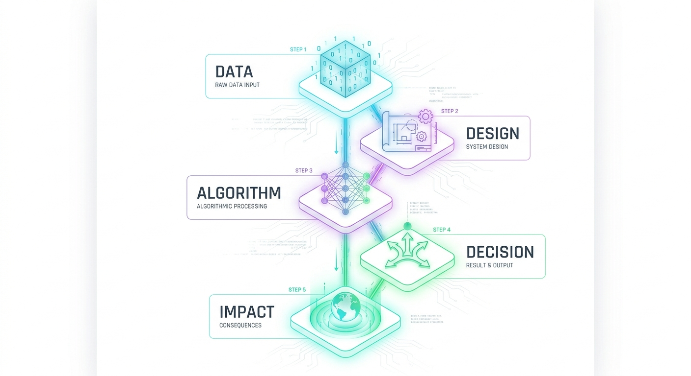

## Today's Big Question

### Can an algorithm be biased?

 

### And if it can...

**Who is responsible?**

---

## Opening Poll

# Can an algorithm be biased?

**Don't overthink it.**

Be prepared to explain your answer.

---

## A Simple Scenario

A company creates an algorithm to identify the **best job applicants**.

It is trained using:

> **10 years of the company's previous employees**

It learns which characteristics are associated with employees who received high performance ratings.

### Question

**What's wrong with this approach?**

---

### If the company's previous employees were mostly:

- men
- graduates of certain colleges
- from certain regions
- people with traditional career paths

...

what might the algorithm learn?

---

### The algorithm may learn:

> **"What has worked in the past."**

But that is not necessarily the same as:

> **"What would be fair in the future."**

---

## The Bias Pipeline

# Where can bias enter?

 At every stage, we can ask:

 > **What choices are being made?**

---

## DATA

### What information does the algorithm use?

 Ask:

 - Who collected the data?
- Who is represented?
- Who is missing?
- How was the data generated?
- Does the data reflect historical inequalities?

 > **Data is not simply "the facts."**

 Data reflects how the world was measured.

---

## Example-Unrepresentative Training Data

:::: {.columns}

::: {.column width="50%"}
### Facial Recognition Software

- Training set mostly lighter-skinned faces
- Darker-skinned females were the most misclassified group (error rates of up to 34.7%)
- Maximum error rate for lighter-skinned males at 0.8%.

:::

::: {.column width="50%"}
{width="100%"}
:::

::::

---

## DESIGN

### What does the designer decide matters?

 Every algorithm has a goal.

 For example:

 > "Predict who will be a successful employee."

 But what counts as **successful**?

 - High performance review?
- Salary?
- Promotion?
- Retention?
- Manager satisfaction?

##### Someone has to choose.

---

## ALGORITHM

### What patterns does it look for?

 An algorithm may discover relationships that humans did not explicitly program.

 For example:

 > "People with X characteristics tend to receive higher scores."

 But:

### Correlation ≠ Causation

 A pattern can exist without being a fair basis for a decision.

---

## DECISION

### How is the algorithm's output used?

 Imagine an algorithm produces:

#### 87% probability

 What happens next?

 - Is the person automatically rejected?
- Does a human review the case?
- Can the person appeal?
- Is the score only one piece of evidence?

## The same algorithm can have different consequences depending on how it is used.

---

## IMPACT

#### Who benefits?

#### Who could be harmed?

 Ask:

 - Who receives opportunities?
- Who loses opportunities?
- Who gets more scrutiny?
- Who gets less access?
- Who can appeal?

 > **An algorithm can be mathematically accurate and still raise ethical questions.**

---

## Takeaways

- Think Twice Before downloading free apps - you are paying with your data!
- Provide Feedback - Biased or inappropriate search results? Provide search feedback
- Request Transparency - From corporations
- Opt-out - From data collection whenever possible
- Get Involved - Advocacy and educational groups

## Organizations

:::: {.columns}

::: {.column width="50%"}
### Data & AI Research

- Data & Society
- AI Now Institute

These organizations conduct research on the social, political, and public-interest implications of technology and AI.
:::

::: {.column width="50%"}
{width="80%"}

 

{width="80%"}
:::

::::

# Final Question

## Who should be responsible?

 Imagine an algorithm makes a harmful decision.

 Who should be accountable?

 1. **Programmer**
2. **Company**
3. **Data scientists**
4. **Institution using the algorithm**
5. **Human decision-maker**
6. **Government/regulators**
7. **Everyone involved**
8. **Nobody**
