# Decision Trees

## Structure

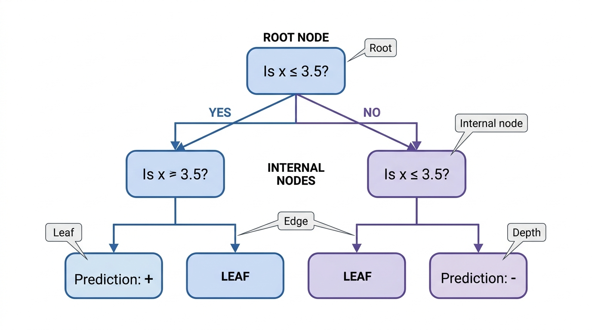


## Terminology

A decision tree asks a sequence of questions to make a prediction

| **Component** | **What it does** |
|---|---|
| 🌱 **Root** | Starting point; contains the **entire dataset** |
| ❓ **Internal node** | Applies a **question / decision rule** |
| → **Edge** | Represents the **outcome** of a rule |
| 🍃 **Leaf** | End of a path; produces the **final prediction** |
| ↕ **Depth** | Number of edges from the **root** to a node |

::: {.callout-note appearance="simple"}
### The basic idea

$$
\boxed{\text{Question} \;\rightarrow\; \text{Split data} \;\rightarrow\;
\text{Ask another question} \;\rightarrow\; \text{Predict}}
$$
:::

**Classification:** a leaf predicts a **class** (e.g., $+$ or $-$).

**Regression:** a leaf predicts a **numeric value** (typically the mean of the targets in that leaf).

---

## CART Tree Construction Algorithm

* Goal: Create the *smallest/simplest* tree that fits the training data
* Doing this optimally is NP-Hard
* Greedy Algorithm: 
  * Start with a root node containing the full data set.
  * If there is only one class, terminate
  * Else, check every possible split point for every attribute.
    * (Involves sorting the data using the attributes as the key)
  * Select the split that results in the greatest overall reduction in impurity
  * Distribute the data to the two children according to that split
  * Recursively build decision trees starting at the two children

## A Training Set to Work With

:::: {columns}
::: {.column width="50%"}

| $x_1$ | $x_2$ | class |
|:-----:|:-----:|:-----:|
| 2 | 4 | + |
| 7 | 9 | + |
| 6 | 3 | − |
| 1 | 1 | + |
| 9 | 5 | − |
| 3 | 7 | + |

Two attributes, two classes, six examples.

Root node: **4 +, 2 −**

:::
::: {.column width="50%"}

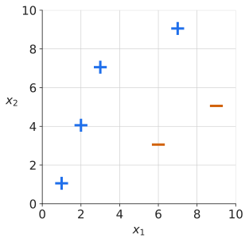

:::
::::

<!--
Six examples is enough to enumerate every candidate split by hand and
still finish in one pass.  The final tree uses both attributes, so the
partition picture is worth drawing.
-->

## Step 1: Enumerate the Candidate Splits

Sort by each attribute, then consider the midpoint between each pair of adjacent values.

:::: {columns}
::: {.column width="30%"}

| $x_1$ | $x_2$ | class |
|:-----:|:-----:|:-----:|
| 2 | 4 | + |
| 7 | 9 | + |
| 6 | 3 | − |
| 1 | 1 | + |
| 9 | 5 | − |
| 3 | 7 | + |

:::
::: {.column width="70%"}

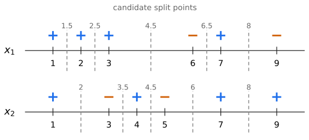

:::
::::

**Five split points per attribute, ten candidates in all.**

<!--
This is the slide that replaces the sorting I did badly on the board.
Ask where the reasonable split points are before revealing.  Worth
noting: duplicate values would produce fewer candidates, and n distinct
values give n minus 1 split points.
-->

## Entropy

* The information associated with an event is defined as: $I(E) = -\log_2 p(E)$
  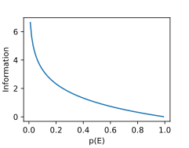

* Entropy is expected information: $\displaystyle -\sum_{i=1}^{c}  \Big ( p_i  \log_2 ( p_i ) \Big )$

## Gini Impurity

* The fraction of incorrect predictions in a node if the class of each element was predicted by randomly selecting a label according to the distribution of classes in the node:

  $\displaystyle \phi(\mathbf{p}) = \sum_i p_i(1-p_i)$

  * $(1-p_i)$ is the probability of making a mistake for class $i$.
* Can be rewritten as:
  $\displaystyle \phi(\mathbf{p}) = 1 - \sum_i p_i^2$


## Impurity Formulas: Gini vs. Entropy

| Measure | Formula at Node $i$ | Scikit-Learn Flag | Behavior |
| --- | --- | --- | --- |
| **Gini Impurity** | $1 - \sum_{k=1}^{K} p_{ki}^{2}$ | `criterion="gini"` _(Default)_ | Measures misclassification probability. Reaches peak at equal class distribution ($p\_{ki} = 1/K$). |
| **Entropy** |  $-\sum_{k=1}^{K} p_{ki}\log_{2}(p_{ki})$ | `criterion="entropy"` | Information-theoretic measure of uncertainty/disorder. Peak occurs when $p\_{ki} = 1/K$. |

> **Note:** $p_{ki}$ represents the proportion of instances of class $k$ present at node $i$.

---


## What the Numbers Look Like

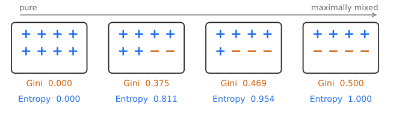

Both measures are $0$ for a pure node and largest when the node is evenly mixed.

## Entropy vs. Gini

:::: {columns}
::: {.column width="50%"}

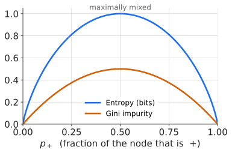

:::
::: {.column width="50%"}

* Same shape, same zeros, same peak location.
* Entropy peaks at $1$ (it is measured in **bits**); Gini peaks at $0.5$.
* **Which should you use?** Doesn't much matter. Gini is a bit cheaper: squaring beats taking a logarithm. Entropy tends to give more balanced splits.

:::
::::

## Scoring a Split

* A split produces two children, so we need a single number for the pair. Weight each child by the fraction of examples that land in it:

  $\displaystyle \phi_{\text{split}} = \frac{m_{\text{left}}}{m}\phi(\text{left}) + \frac{m_{\text{right}}}{m}\phi(\text{right})$

* The **gain** is the reduction in impurity:

  $\displaystyle \text{Gain} = \phi(\text{parent}) - \phi_{\text{split}}$

* $\phi(\text{parent})$ is the same for every candidate, so maximizing gain and minimizing $\phi_{\text{split}}$ are the same thing.

## Step 2: Score Every Candidate

Root: 4 +, 2 −, so $\phi(\text{parent}) = 1 - \left(\tfrac{4}{6}\right)^2 - \left(\tfrac{2}{6}\right)^2 = 0.444$

:::: {columns}
::: {.column width="50%"}

| split | left | right | $\phi_{\text{split}}$ | gain |
|:--|:--:|:--:|:--:|:--:|
| $x_1 \le 1.5$ | | | | |
| $x_1 \le 2.5$ | | | | |
| $x_1 \le 4.5$ | | | | |
| $x_1 \le 6.5$ | | | | |
| $x_1 \le 8$ | | | | |

:::
::: {.column width="50%"}

| split | left | right | $\phi_{\text{split}}$ | gain |
|:--|:--:|:--:|:--:|:--:|
| $x_2 \le 2$ | | | | |
| $x_2 \le 3.5$ | | | | |
| $x_2 \le 4.5$ | | | | |
| $x_2 \le 6$ | | | | |
| $x_2 \le 8$ | | | | |

:::
::::

<!--
Work a few of these together rather than all ten.  Good ones to pick:
x1 <= 4.5 (the winner, one pure child), x2 <= 4.5 (gain of exactly zero,
which surprises people), and x1 <= 8 (the runner up).
-->

## Step 2: The Answers

<div class="tight">

| split | left | right | $\phi_{\text{split}}$ | gain |
|:--|:--:|:--:|:--:|:--:|
| $x_1 \le 4.5$ | 3 +, 0 − | 1 +, 2 − | **0.222** | **0.222** |
| $x_1 \le 8$ | 4 +, 1 − | 0 +, 1 − | 0.267 | 0.178 |
| $x_1 \le 2.5$ | 2 +, 0 − | 2 +, 2 − | 0.333 | 0.111 |
| $x_2 \le 6$ | 2 +, 2 − | 2 +, 0 − | 0.333 | 0.111 |
| $x_1 \le 1.5$ | 1 +, 0 − | 3 +, 2 − | 0.400 | 0.044 |
| $x_2 \le 2$ | 1 +, 0 − | 3 +, 2 − | 0.400 | 0.044 |
| $x_2 \le 8$ | 3 +, 2 − | 1 +, 0 − | 0.400 | 0.044 |
| $x_1 \le 6.5$ | 3 +, 1 − | 1 +, 1 − | 0.417 | 0.028 |
| $x_2 \le 3.5$ | 1 +, 1 − | 3 +, 1 − | 0.417 | 0.028 |
| $x_2 \le 4.5$ | 2 +, 1 − | 2 +, 1 − | 0.444 | 0.000 |

</div>

Winner: $x_1 \le 4.5$.

<!--
Worth pointing at the last row.  It splits 4 plus 2 minus into two nodes
that are each 2 plus 1 minus, so the children are exactly as impure as
the parent and the gain is zero.
-->

## Step 3: Take the Best Split

:::: {columns}
::: {.column width="50%"}


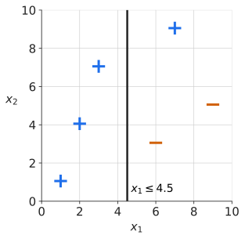

:::

::: {.column width="50%"}

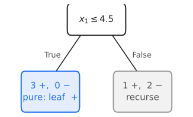

:::
::::

Left child is pure, so it becomes a leaf. Right child still holds 1 +, 2 −, so we recurse.

## Step 4: Recurse on the Right Child

:::: {columns}
::: {.column width="50%"}


Three examples: $(7,9,+)$, $(6,3,-)$, $(9,5,-)$

Only **two** split points per attribute now.

| split | left | right | $\phi_{\text{split}}$ | gain |
|:--|:--:|:--:|:--:|:--:|
| $x_2 \le 7$ | 0 +, 2 − | 1 +, 0 − | **0.000** | **0.444** |
| $x_1 \le 6.5$ | 0 +, 1 − | 1 +, 1 − | 0.333 | 0.111 |
| $x_1 \le 8$ | 1 +, 1 − | 0 +, 1 − | 0.333 | 0.111 |
| $x_2 \le 4$ | 0 +, 1 − | 1 +, 1 − | 0.333 | 0.111 |

:::
::: {.column width="50%"}


Both children of $x_2 \le 7$ are pure, so both become leaves and the algorithm terminates.

Note that the candidate set shrinks as we descend: fewer examples means fewer distinct values means fewer split points.

:::
::::

## Two Views of the Finished Tree

:::: {columns}
::: {.column width="50%"}

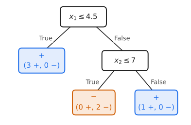

:::
::: {.column width="50%"}

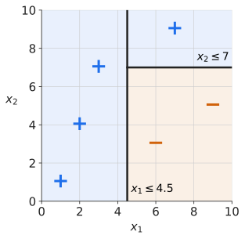

:::
::::

Every internal node is an axis-aligned cut. **Three leaves, three regions.** A tree and a partition of the feature space are the same object.

## MSE 

* For regression trees, we are predicting a real value:
  $\displaystyle\hat{y}_{\text{node}} = \frac{\sum_{i\in \text{node}}y^{(i)}}{m_{\text{node}}}$
* MSE is then:
  $\displaystyle MSE_{\text{node}} = \frac{\sum_{i\in \text{node}}(\hat{y}_{\text{node}} - y^{(i)})^2}{m_{\text{node}}}$
* (Notice that this is exactly the sample variance)

## MSE: A Worked Example

:::: {columns}
::: {.column width="50%"}


| $x$ | 1 | 2 | 3 | 4 | 5 | 6 |
|:--|:--:|:--:|:--:|:--:|:--:|:--:|
| $y$ | 3 | 5 | 4 | 12 | 10 | 14 |

:::
::: {.column width="50%"}


$\hat{y}_{\text{root}} = \frac{48}{6} = 8$

$MSE_{\text{root}} = \frac{25+9+16+16+4+36}{6} \approx 17.67$

:::
::::

<div class="wide">

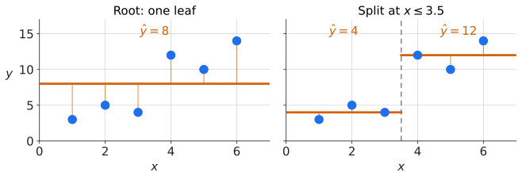

</div>

Same algorithm, same weighted average, different $\phi$. Low MSE means a tight cluster of target values.

# Worked Example: Gini Impurity Gain Calculation

## Scenario

 Evaluating a binary split on a parent node with $N = 10$ samples:

 - 6 Arabica
- 4 Robusta

### Step 1: Calculate Parent Node Impurity

 $$
p_{\text{Arabica}} = \frac{6}{10} = 0.6,
\qquad
p_{\text{Robusta}} = \frac{4}{10} = 0.4
$$

 $$
\text{Gini}_{\text{parent}}
=
1 - (0.6^2 + 0.4^2)
=
1 - (0.36 + 0.16)
=
\mathbf{0.480}
$$

---

### Step 2: Evaluate Split Outcome

 Suppose the candidate feature $X_1 \le 8.0$ splits the 10 samples into two child nodes:

- **Left Child ($N_L = 5$):** 5 Arabica, 0 Robusta

  $$
  \begin{aligned}
  \text{Gini}_L
  &= 1 - \left(1.0^2 + 0.0^2\right) \\
  &= \mathbf{0.000}
  \qquad \text{(Pure Node)}
  \end{aligned}
  $$

- **Right Child ($N_R = 5$):** 1 Arabica, 4 Robusta

  $$
  \begin{aligned}
  \text{Gini}_R
  &= 1 - \left(0.2^2 + 0.8^2\right) \\
  &= 1 - (0.04 + 0.64) \\
  &= \mathbf{0.320}
  \end{aligned}
  $$

---

### Step 3: Compute Weighted Child Impurity & Gain

 $$
\text{Gini}_{\text{split}}
=
\frac{5}{10}(0.000)
+
\frac{5}{10}(0.320)
=
\mathbf{0.160}
$$

 $$
\Delta \text{Gini}
=
\text{Gini}_{\text{parent}}
-
\text{Gini}_{\text{split}}
=
0.480 - 0.160
=
\mathbf{0.320}
$$

 > **Decision Rule:** CART selects the split that maximizes impurity reduction ($\Delta \text{Gini}$).

---

## Issues to Consider

* Default algorithm builds tree until the leaves are 100% pure.
* Likely to result in overfitting.
* Solutions:
  * Pruning - build out the full tree, then combine leaves that don't significantly improve classification
  * Restrict the size of the tree during construction - limit the depth, number of leaves, etc.
  * Looking ahead: Ensemble methods that combine multiple trees

## What Overfitting Looks Like

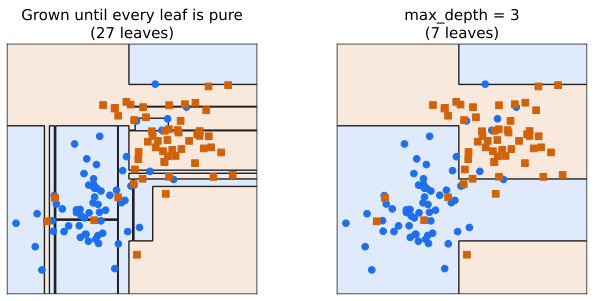

The left tree gets every training point right. The extra slivers are chasing noise, and they will cost accuracy on data the tree has not seen.

## Pros/Cons

* Pros:
  * Prediction is fast
  * Explainable
  * We don't need to worry about the relative scale of the different attributes

* Cons
  * Sensitive to data orientation
  * Generally not very competitive in terms of accuracy

## Sensitive to Data Orientation

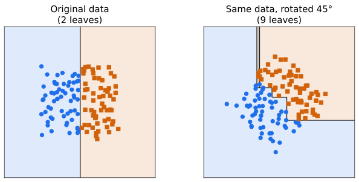

Every split is axis-aligned, so a boundary that is not axis-aligned has to be approximated by a staircase. Same data, same labels, much bigger tree.

# Scikit-Learn Implementation

## Basic Syntax

 In `scikit-learn`, decision tree classifiers are provided by the `DecisionTreeClassifier` class.

```
import pandas as pd
from sklearn.tree import DecisionTreeClassifier
from sklearn.model_selection import train_test_split

# 1. Load dataset
data = pd.read_csv("coffee.csv")

X = data[["sweetness", "uniformity", "acidity"]]
y = data["species"]

# 2. Train-test split
X_train, X_test, y_train, y_test = train_test_split(
    X,
    y,
    test_size=0.2,
    random_state=42
)

# 3. Instantiate and fit model
dtc = DecisionTreeClassifier(random_state=42)
dtc.fit(X_train, y_train)

# 4. Predict classes and probabilities
y_pred = dtc.predict(X_test)
y_prob = dtc.predict_proba(X_test)
classes = dtc.classes_
```

---

## 5\. Early Stopping (Pre-Pruning)

 Unconstrained decision trees tend to grow until every leaf is 100% pure, memorizing training noise and leading to **severe overfitting**.

 **Early stopping** restricts tree growth during training using stopping thresholds:

 | Hyperparameter | Default | Description / Constraint Function |
| --- | --- | --- |
| `max_depth` | `None` | Caps maximum distance from root to leaf node. |
| `min_samples_split` | `2` | Minimum samples (int or float fraction) required to attempt a split. |
| `min_samples_leaf` | `1` | Minimum samples required in resulting left and right child nodes. |
| `max_leaf_nodes` | `None` | Limits total leaf count; expands best nodes first. |

---

## Early Stopping Code Example

```
from sklearn.tree import DecisionTreeClassifier

# Configure pre-pruning / early stopping parameters
dtc_constrained = DecisionTreeClassifier(
    criterion="gini",
    max_depth=3,             # Maximum tree depth of 3
    min_samples_split=10,    # Needs >= 10 samples to consider splitting
    min_samples_leaf=4,      # Every leaf must have >= 4 samples
    max_leaf_nodes=8,        # Maximum of 8 total leaves
    random_state=42
)

# Train model on training set
dtc_constrained.fit(X_train, y_train)

# Evaluate generalization
print("Train Score:", dtc_constrained.score(X_train, y_train))
print("Test Score: ", dtc_constrained.score(X_test, y_test))
```

---

## Google Colab

[Open the notebook in Google Colab](https://colab.research.google.com/drive/1joqQfvPDQFU9vW9wSlGT_U9R9XHFLRvZ?usp=sharing)
