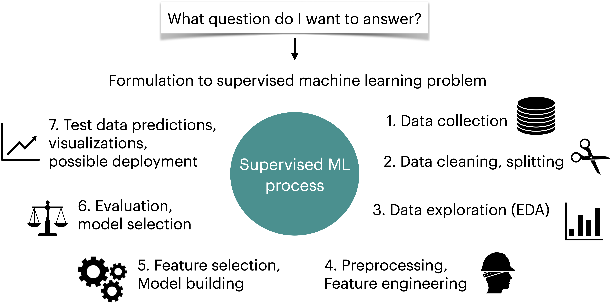
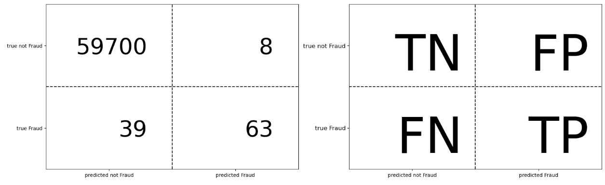
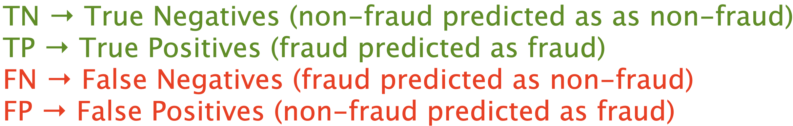
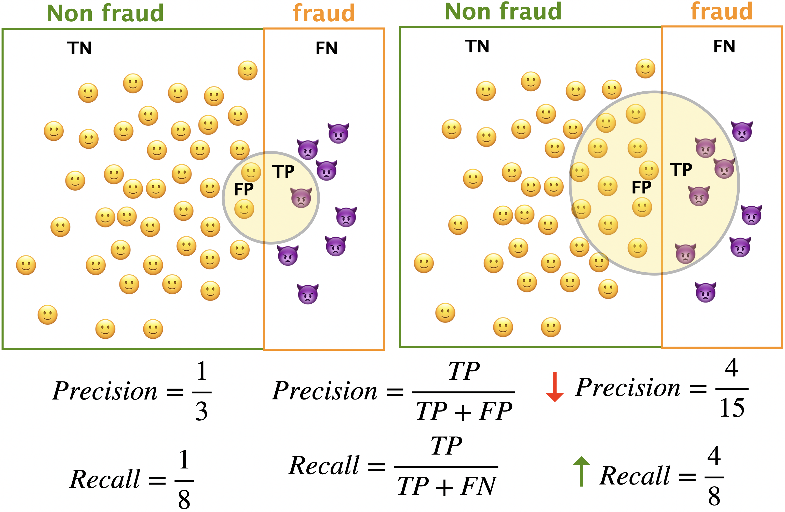
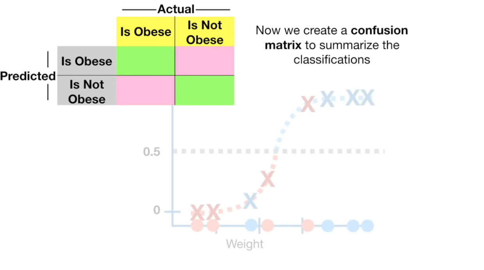
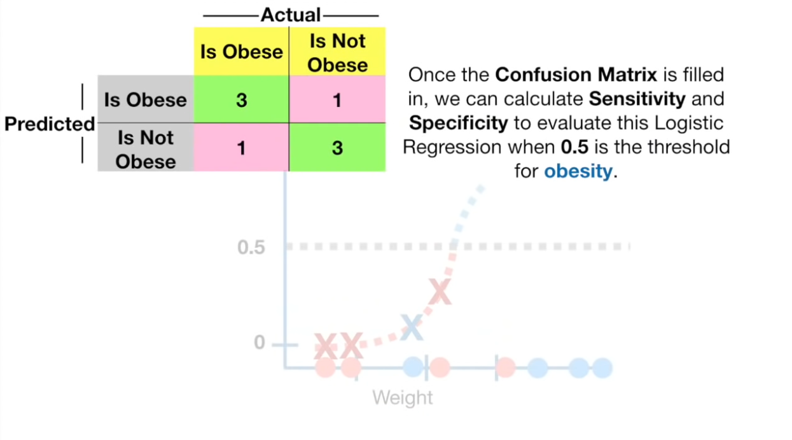
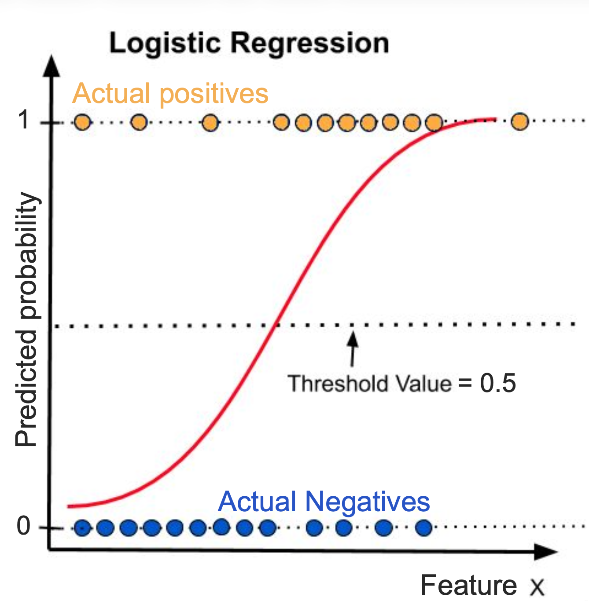
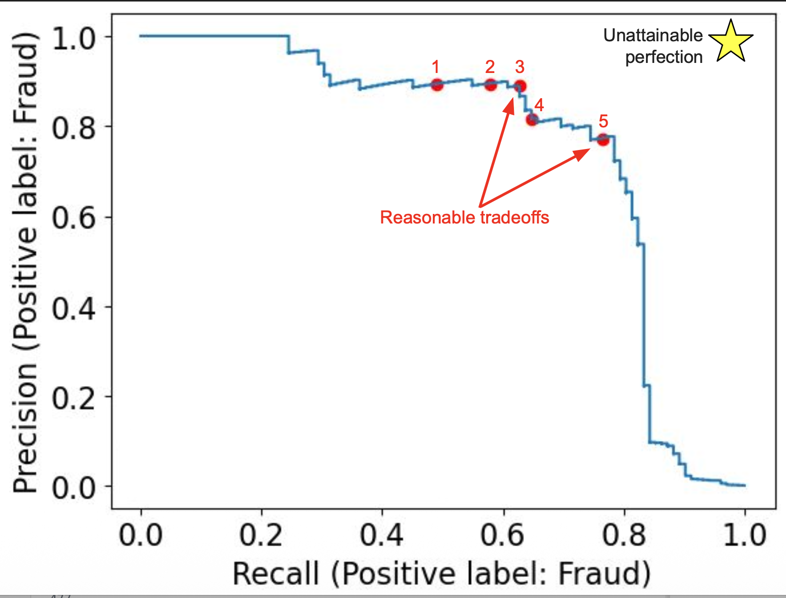
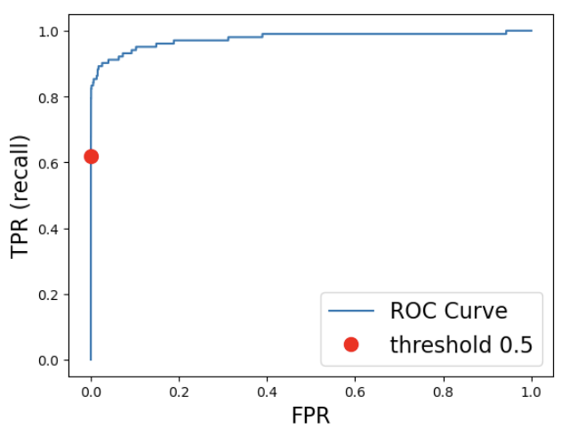

```{python}
import os
import sys
import pandas as pd 
import numpy as np
from sklearn import datasets
from sklearn.svm import SVC
from sklearn.model_selection import cross_val_score, cross_validate, train_test_split
from sklearn.pipeline import Pipeline, make_pipeline
from sklearn.linear_model import LogisticRegression
import matplotlib.pyplot as plt
from sklearn.preprocessing import StandardScaler
%matplotlib inline
from sklearn.dummy import DummyClassifier
from sklearn.model_selection import cross_validate
import mglearn
DATA_DIR = '../data/' 
```

## Learning objectives

By the end of this lecture, you should be able to:

- Define a **loss function**.
- Explain why loss functions are useful in machine learning.
- Interpret the value of a loss function.
- Identify common loss functions for classification.
- Explain the differences between:
  - Absolute loss
  - Log loss
  - Cross-entropy loss
  - Hinge loss
- Compute classification losses using **scikit-learn**.

---

## Where do loss functions fit?

Recall our supervised learning workflow:

**Data → Model → Predictions → Loss → Optimization**

A loss function tells us:

> **How bad are the model's predictions?**

During model fitting, we choose model parameters that minimize the loss.

---

## What is a loss function?

A **loss function** quantifies the difference between:

- what actually happened, and
- what the model predicted.

In general:

$$
\text{Loss} =
\text{difference between predictions and observations}
$$

**Lower loss = better predictions.**

---

## Why do we need loss functions?

Suppose two classifiers both get 90% of observations correct.

Are they equally good?

Not necessarily.

A model might:

- make confident correct predictions,
- make uncertain correct predictions,
- make confident incorrect predictions.

A good loss function should capture more than simply:

> "Was the final class correct?"

---

## A simple example

Suppose the observed class is:

$$
y = 1
$$

Two models predict:

| Model | Predicted probability |
|:--|--:|
| Model A | 0.99 |
| Model B | 0.51 |

Both predict class 1.

But which prediction is better?

**Model A.**

It is much more confident that the observation belongs to class 1.

---

## Accuracy vs. probability

Accuracy only looks at the final class:

$$
\hat y =
\begin{cases}
1 & \hat p \geq 0.5\\
0 & \hat p < 0.5
\end{cases}
$$

So these predictions all produce the same class:

$$
0.51,\quad 0.70,\quad 0.99
$$

But a loss function can distinguish between them.

---

# Absolute loss

## Absolute loss

For binary classification:

- $y$ = observed class, either 0 or 1
- $\hat p$ = predicted probability of class 1

Absolute loss is:

$$
L_{\text{abs}}(y,\hat p)
=
|y-\hat p|
$$

The loss is simply the distance between:

- the observed class, and
- the predicted probability.

---

## Absolute loss: observed class = 1

Suppose:

$$
y=1
$$

Then:

$$
L_{\text{abs}} = |1-\hat p|
$$

Consider three predictions:

| $\hat p$ | Absolute loss |
|---:|---:|
| 0.99 | 0.01 |
| 0.70 | 0.30 |
| 0.20 | 0.80 |

The farther the predicted probability is from 1, the larger the loss.

---

## Absolute loss: observed class = 0

Suppose:

$$
y=0
$$

Then:

$$
L_{\text{abs}} = |0-\hat p| = \hat p
$$

For example:

| $\hat p$ | Absolute loss |
|---:|---:|
| 0.01 | 0.01 |
| 0.30 | 0.30 |
| 0.80 | 0.80 |

For an observed class of 0, we want the predicted probability of class 1 to be **small**.

---

## Absolute loss: intuition

Think of the observed class as the target:

$$
0 \qquad\text{or}\qquad 1
$$

The predicted probability should be close to that target.

**Small loss:**

$$
y=1,\quad \hat p=0.95
$$

**Large loss:**

$$
y=1,\quad \hat p=0.10
$$

---

## Example: diabetes prediction

Suppose a patient actually has diabetes:

$$
y=1
$$

Our logistic regression model predicts:

$$
\hat p=0.9073
$$

Then:

$$
L_{\text{abs}}
=
|1-0.9073|
=
0.0927
$$

That's a relatively small loss.

---

## Example: incorrect confidence

Now suppose a patient actually has diabetes:

$$
y=1
$$

but the model predicts:

$$
\hat p=0.10
$$

Then:

$$
L_{\text{abs}}
=
|1-0.10|
=
0.90
$$

The model is very wrong **and** very confident.

---

## Absolute loss

### Key takeaway

Absolute loss:

- ranges from **0 to 1**
- is smallest when predictions are close to the observed class
- is largest when predictions are far from the observed class

For $n$ observations:

$$
L_{\text{overall}}
=
\frac{1}{n}
\sum_{i=1}^{n}
|y_i-\hat p_i|
$$

---

## Clicker Exercise 1

**Which prediction has the smallest absolute loss?**

The observed class is:

$$
y=1
$$

- (A) $\hat p=0.05$
- (B) $\hat p=0.25$
- (C) $\hat p=0.75$
- (D) $\hat p=0.99$

---

## Clicker Exercise 1

**Which prediction has the smallest absolute loss?**

The observed class is:

$$
y=1
$$

- (A) $\hat p=0.05$
- (B) $\hat p=0.25$
- (C) $\hat p=0.75$
- (D) $\hat p=0.99$

**Answer: D**

---

## Activity: Think–Pair–Share

An individual **does not** have diabetes:

$$
y=0
$$

The model predicts:

$$
\hat p=0.65
$$

What is the absolute loss?


**Question:** Is this a good prediction?

---

## Activity: Think–Pair–Share

An individual **does not** have diabetes:

$$
y=0
$$

The model predicts:

$$
\hat p=0.65
$$

What is the absolute loss?

$$
L_{\text{abs}}
=
|0-0.65|
=
0.65
$$

**Question:** Is this a good prediction?

---

## Activity: How Bad Is the Prediction?

A model is predicting whether a patient has diabetes.

The actual outcome is:

$$
y=0
$$

Three models make the following predictions:

| Model | Prediction $\hat p$ | Absolute Loss |
|:---|---:|---:|
| A | 0.10 | ? |
| B | 0.40 | ? |
| C | 0.80 | ? |

---

## Think

1. Calculate the absolute loss for each model:

$$
L_{\text{abs}}=|y-\hat p|
$$

2. Rank the three models from **best prediction to worst prediction**.

3. Model B predicts a probability of $0.40$. What does that actually mean in this context?

---

## Pair

Compare your answers with a partner.

- Which model has the smallest loss?
- How much better is Model A than Model C?
- Does a smaller absolute loss always mean a prediction is closer to the **actual outcome**?

---

## Share

Discuss:

> **If the actual outcome is $y=0$, should a model that predicts $0.51$ be considered a "good" prediction simply because it is relatively close to 0.5? Why or why not?**

---

## Reveal

$$
L_A=|0-0.10|=0.10
$$

$$
L_B=|0-0.40|=0.40
$$

$$
L_C=|0-0.80|=0.80
$$

So the ranking is:

$$
\boxed{A>B>C}
$$

The key idea is that **absolute loss measures how far the prediction is from the actual value**.

The smaller the loss, the closer the prediction is to what actually happened.

---

## Extension Question

Now suppose the actual outcome changes:

$$
y=1
$$

but the three models make the **same predictions**.

> **Which model is now best? What does this tell you about why loss must always be calculated using both $y$ and $\hat p$?**

---

## Key Takeaway

**Absolute loss tells us how far a prediction is from the observed outcome.**

But interpreting whether a prediction is *good* may require more context than the loss alone.

The reference point matters.

---

# Log loss

## Why do we need another loss?

Absolute loss treats the difference between predictions linearly.

But sometimes we want to penalize **confidently wrong predictions much more strongly**.

Consider:

$$
y=1
$$

Compare:

$$
\hat p=0.40
$$

with:

$$
\hat p=0.01
$$

The second prediction is not merely "a little worse."

It is **extremely confident and wrong**.

---

## Log loss

For binary classification:

$$
L_{\text{log}}
=
-\left[
y\log(\hat p)
+
(1-y)\log(1-\hat p)
\right]
$$

This is also called:

- **log loss**
- **binary cross-entropy**
- **binary cross-entropy loss**

---

## Log loss: observed class = 1

If:

$$
y=1
$$

then:

$$
L_{\text{log}}
=
-\log(\hat p)
$$

Examples:

| $\hat p$ | Log loss |
|---:|---:|
| 0.99 | 0.010 |
| 0.90 | 0.105 |
| 0.50 | 0.693 |
| 0.10 | 2.303 |
| 0.01 | 4.605 |

Notice what happens near zero.

---

## Log loss strongly penalizes confidence

For an observed class of 1:

$$
\hat p \rightarrow 1
\quad\Rightarrow\quad
L_{\text{log}}\rightarrow 0
$$

But:

$$
\hat p \rightarrow 0
\quad\Rightarrow\quad
L_{\text{log}}\rightarrow \infty
$$

So log loss strongly penalizes:

> **being confidently wrong.**

---

## Comparing absolute loss and log loss

Suppose:

$$
y=1,\quad \hat p=0.01
$$

Absolute loss:

$$
|1-0.01|=0.99
$$

Log loss:

$$
-\log(0.01)\approx4.605
$$

The log loss gives a much stronger penalty.

---

## Why use log loss?

Log loss rewards models that:

- assign high probability to the correct class,
- avoid assigning tiny probability to the correct class,
- produce useful probability estimates.

This makes it especially useful for models such as:

- Logistic Regression
- probabilistic classifiers

---

## Log loss and logistic regression

Recall logistic regression:

$$
\hat p = P(Y=1\mid X)
$$

The model learns coefficients that produce probabilities.

The coefficients can be fitted by minimizing log loss.

So:

> **Logistic regression + log loss**

is a natural pairing.

---

## Clicker Exercise 2

An observation has:

$$
y=1
$$

Two models predict:

- Model A: $\hat p=0.10$
- Model B: $\hat p=0.40$

Which model has the **larger log loss**?

- **(A)** Model A
- **(B)** Model B
- **(C)** They are equal
- **(D)** Not enough information

---

## Think About It

Recall the log loss:

$$
L_{\log}
=
-\left[
y\log(\hat p)
+
(1-y)\log(1-\hat p)
\right]
$$

Here:

$$
y=1
$$

What does the loss simplify to?

---

## Simplify

When $y=1$:

$$
L_{\log}
=
-\log(\hat p)
$$

So we only need to compare:

$$
-\log(0.10)
\quad\text{and}\quad
-\log(0.40)
$$

Which prediction should receive the **larger penalty**?

---

## Reveal

$$
L_A=-\log(0.10)\approx2.30
$$

$$
L_B=-\log(0.40)\approx0.92
$$

Therefore:

$$
\boxed{L_A>L_B}
$$

**Answer: (A) Model A**

---

## Why?

Model A assigns only **10% probability** to the outcome that actually occurred.

Model B assigns **40% probability**.

So Model A is **more confidently wrong**.

> **Log loss strongly penalizes confident wrong predictions.**

The key idea:

$$
\boxed{\text{More confident + wrong}
\;\Longrightarrow\;
\text{larger log loss}}
$$

---

## Log loss: intuition

Ask:

> "How much probability did the model give to the outcome that actually happened?"

If the observed class is 1:

$$
\hat p=0.99
$$

Great!

If:

$$
\hat p=0.01
$$

Very bad.

The logarithm makes the penalty especially severe when the model assigns tiny probability to the observed outcome.

---

# Cross-entropy loss

## From binary to multiclass classification

Log loss works naturally for:

$$
Y\in\{0,1\}
$$

What if we have three classes?

For example:

- Nondiabetic
- Prediabetic
- Diabetic

Now the model produces a probability for **each class**.

---

## Multiclass probabilities

Suppose the model predicts:

| Class | Probability |
|:--|--:|
| Nondiabetic | 0.55 |
| Prediabetic | 0.08 |
| Diabetic | 0.37 |

The probabilities must add to 1:

$$
0.55+0.08+0.37=1
$$

---

## Observed class

Suppose the actual class is:

**Prediabetic**

We can represent the observed class using a one-hot vector:

$$
\mathbf y =
[0,1,0]
$$

The model predicts:

$$
\hat{\mathbf p}
=
[0.55,0.08,0.37]
$$

---

## Cross-entropy loss

The multiclass cross-entropy loss is:

$$
L_{\text{CE}}
=
-\sum_{j=1}^{K}
y_j\log(\hat p_j)
$$

Because $y_j$ is 1 only for the observed class, this simplifies to:

$$
L_{\text{CE}}
=
-\log(\hat p_{\text{observed}})
$$

---

## Example

Actual class:

**Prediabetic**

Predicted probability:

$$
\hat p_{\text{prediabetic}}=0.08
$$

Therefore:

$$
L_{\text{CE}}
=
-\log(0.08)
\approx2.526
$$

That's a relatively large loss.

The model gave the correct class only **8% probability**.

---

## Cross-entropy intuition

The model should assign a high probability to the class that actually occurs.

**Good:**

$$
[0.05,\;0.90,\;0.05]
$$

when the true class is prediabetic.

**Bad:**

$$
[0.55,\;0.08,\;0.37]
$$

when the true class is prediabetic.

---

## Binary vs. multiclass

| Task | Common loss |
|:--|:--|
| Binary classification | Log loss |
| Multiclass classification | Cross-entropy |
| Binary cross-entropy | Same mathematical idea as binary log loss |

In scikit-learn, `log_loss()` handles both binary and multiclass cases.

---

## Clicker Exercise 3

A three-class classifier predicts:

$$
[0.70,\;0.20,\;0.10]
$$

The true class is class 3.

What is the cross-entropy loss?

---

## Clicker Exercise 3

A three-class classifier predicts:

$$
[0.70,\;0.20,\;0.10]
$$

The true class is class 3.

What is the cross-entropy loss?

$$
-\log(0.10)
\approx2.303
$$

Is this:

- (A) Small
- (B) Large

---

# Hinge loss

## A different type of classifier

Some classifiers don't naturally output probabilities.

For example:

**Support Vector Classifiers**

Instead, they can return a **signed distance from a decision boundary**.

---

# Hinge Loss

Hinge loss is commonly used for **binary classification**, especially with **support vector machines (SVMs)**.

Instead of asking only whether the prediction is correct, hinge loss also considers **how confidently the model makes the correct prediction**.

For labels:

$$
y\in\{-1,+1\}
$$

and model score:

$$
f(x)
$$

the hinge loss is:

$$
L_{\text{hinge}}
=
\max(0,\;1-yf(x))
$$

---

# Example

 Suppose the true class is:

 $$
y=+1
$$

 The model produces:

 $$
f(x)=0.5
$$

 Calculate the hinge loss:

 $$
L_{\text{hinge}}
=
\max(0,\;1-(+1)(0.5))
$$

 $$
=
\max(0,\;0.5)
=
0.5
$$

 **Question:** What would happen to the loss if the model's score increased to $2$?

---

# The Key Idea

 For a correct prediction with **enough confidence**:

 $$
yf(x)\geq 1
$$

 the hinge loss is:

 $$
\boxed{0}
$$

 For a prediction that is **wrong or not confident enough**:

 $$
yf(x)<1
$$

 the model receives a positive loss.

 > **Hinge loss encourages the model to be correct with a margin, not merely correct.**

---

## ML workflow 



## Accuracy

- So far, we’ve been measuring model performance using **Accuracy**.  
- **Accuracy** is the proportion of all predictions that were correct — whether *positive* or *negative*.  

$$
\text{Accuracy} = \frac{\text{correct classifications}}{\text{total classifications}}
$$

- But is **accuracy** always the right metric to evaluate a model? 🤔  

## A fraud classification example
```{python}
# This dataset will be loaded using a URL instead of a CSV file
DATA_URL = "https://github.com/firasm/bits/raw/refs/heads/master/creditcard.csv"

cc_df = pd.read_csv(DATA_URL, encoding="latin-1")
# Sorting columns so it is easier to read
cc_df = cc_df[['Class', 'Time', 'Amount'] + cc_df.columns[cc_df.columns.str.startswith('V')].to_list()]

train_df, test_df = train_test_split(cc_df, test_size=0.3, random_state=111)
X_train_big, y_train_big = train_df.drop(columns=["Class", "Time"]), train_df["Class"]
X_test, y_test = test_df.drop(columns=["Class", "Time"]), test_df["Class"]
X_train, X_valid, y_train, y_valid = train_test_split(
    X_train_big, y_train_big, test_size=0.3, random_state=123
)
print(X_train.shape)
train_df.head()
```

## `DummyClassifier`
Let's try a DummyClassifier, which makes predictions without learning any patterns.

```{python}
#| echo: true
dummy = DummyClassifier()
cross_val_score(dummy, X_train, y_train).mean()
```

- The accuracy looks surprisingly high!
- Should we be happy with this model and deploy it?

## Problem: Class imbalance 

```{python}
#| echo: true
y_train.value_counts()
```

- In many real-world problems, some classes are much rarer than others.

- A model that always predicts "no fraud" could still achieve >99% accuracy!
- This is why accuracy can be misleading in imbalanced datasets.
- We need metrics that differentiate types of errors.

## `DummyClassifier`: Confusion matrix 

Which types of errors would be most critical for the bank to address? Missing a fraud case or flagging a legitimate transaction as fraud?

```{python}
from sklearn.metrics import ConfusionMatrixDisplay  

dummy.fit(X_train, y_train)
cm = ConfusionMatrixDisplay.from_estimator(
    dummy, X_valid, y_valid, values_format="d", display_labels=["Non fraud", "Fraud"]
)
```

## `LogisticRegression`: Confusion matrix

Are we doing better with logistic regression? 

```{python}
from sklearn.metrics import ConfusionMatrixDisplay  
pipe = make_pipeline(StandardScaler(), LogisticRegression())
pipe.fit(X_train, y_train)
cm = ConfusionMatrixDisplay.from_estimator(
    pipe, X_valid, y_valid, values_format="d", display_labels=["Non fraud", "Fraud"]
)

```

## Understanding the confusion matrix
:::: {.columns}
:::{.column width="80%"}

:::

:::{.column width="20%"}
- TN $\rightarrow$ True negatives 
- FP $\rightarrow$ False positives 
- FN $\rightarrow$ False negatives
- TP $\rightarrow$ True positives 
:::
::::

# Practice: confusion matrix terminology

## Confusion matrix questions 

Imagine a spam filter model where emails labeled **1 = spam, 0 = not spam**. 

If a spam email is incorrectly classified as not spam, what kind of error is this?

- (A) A false positive
- (B) A true positive
- (C) A false negative
- (D) A true negative

## Confusion matrix questions

In an intrusion detection system, **1 = intrusion, 0 = safe**. 

If the system misses an actual intrusion and classifies it as safe, this is a:

- (A) A false positive
- (B) A true positive
- (C) A false negative
- (D) A true negative

## Confusion matrix questions

In a medical test for a disease, **1 = diseased, 0 = healthy**. 

If a healthy patient is incorrectly diagnosed as diseased, that's a:

- (A) A false positive
- (B) A true positive
- (C) A false negative
- (D) A true negative

## Metrics other than accuracy 

Now that we understand the different types of errors, we can explore metrics that better capture model performance when **accuracy falls short**, especially for **imbalanced datasets**.

We'll start with three key ones:

- **Precision**
- **Recall**
- **F1-score**

## Precision and recall 

Let's revisit our fraud detection scenario. The circle below represents **all transactions predicted as fraud** by an **imaginary toy model** designed to detect fraudulent activity.

{.nostretch fig-align="center" width="600px"}
{.nostretch fig-align="center" width="600px"}

## Intuition behind the two metrics

- **Precision**: *Of all the transactions predicted as fraud, how many were actually fraud?*  
  - High precision $\rightarrow$ few false alarms (low false positives).

- **Recall**: *Of all the actual fraud cases, how many did the model catch?*  
  - High recall $\rightarrow$ few missed frauds (low false negatives).

## Trade-off between precision and recall

- Increasing **recall** often decreases **precision**, and vice versa.  
- Example:  
  - Predict *“fraud”* for every transaction $\rightarrow$ perfect recall, terrible precision.  
  - Predict *“fraud”* only when 100% sure $\rightarrow$ high precision, low recall.

**The right balance depends on the application and cost of errors.**

## F1-score

- Sometimes, we want a **single metric** that balances precision and recall.  
- The **F1-score** is the **harmonic mean** of the two:

$$
F1 = 2 \times \frac{\text{Precision} \times \text{Recall}}{\text{Precision} + \text{Recall}}
$$

- High **F1** means both precision and recall are strong.  
- Useful when we care about both false positives **and** false negatives.

## Summary

| Metric | What it measures | High value means |
|:--------|:----------------|:------------------|
| **Accuracy** | Overall correctness | Model gets most predictions right |
| **Precision** | Quality of positive predictions | Few false alarms |
| **Recall** | Quantity of true positives caught | Few missed positives |
| **F1-score** | Balance of precision & recall | Both precision and recall are high |

## Activity 1: Create Confusion Matrix



[Source: StatQuest](https://www.youtube.com/watch?v=4jRBRDbJemM)

## Activity 2: Calculate Precision, Recall, Specificity

- Recall (aka Sensitivity in biomedical literature)
    - TP/(TP+FN)

- Precision
    - TP/(TP+FP)

- Specificity
    - TN/(TN+FP)



## Break!

Let's take a break!

{fig-align="center"}

## Clicker Exercise 9.1

**Select all of the following statements which are TRUE.**

- (A) In medical diagnosis, false positives are more damaging than false negatives (assume "positive" means the person has a disease, "negative" means they don't).
- (B) In spam classification, false positives are more damaging than false negatives (assume "positive" means the email is spam, "negative" means they it's not).
- (C) If method A gets a higher accuracy than method B, that means its precision is also higher.
- (D) If method A gets a higher accuracy than method B, that means its recall is also higher.

## Counter examples

Method A - higher accuracy but lower precision

| Negative | Positive
| -------- |:-------------:|
| 90      | 5|
| 5      | 0|

Method B - lower accuracy but higher precision

| Negative | Positive
| -------- |:-------------:|
| 80      | 15|
| 0      | 5|

## Takeaway

- **Accuracy** summarizes overall correctness but hides class-specific behaviour.  
- You can have **high accuracy but poor precision or recall**,  
  especially in **imbalanced datasets**.  
- Always check **multiple metrics** before deciding which model is better.

# Threshold-based classification

## Predicting with logistic regression 

:::: {.columns}
:::{.column width="40%"}

:::
:::{.column width="60%"}
- Most classification models don't directly predict labels. They predict scores or probabilities.
- To get a label (e.g., "fraud" or “non fraud"), we choose a threshold (often 0.5).
If the threshold changes, predictions change, and so do the errors. 
- What happens to precision and recall if we change the probability threshold? 
- [Play with classification thresholds](https://developers.google.com/machine-learning/crash-course/classification/thresholding)

::: 
::::

::: {.notes}
- Decreasing the threshold:
  - Increases the number of positive predictions
  - Identify more examples as "fraud" examples
  - More false positives, more true positives. 
  - Recall would either stay the same or go up and precision is likely to go down (precision may increase if all the new examples after decreasing the threshold are TPs).
- Increasing the threshold:
  - Decreases the number of positive predictions
  - Recall would go down or stay the same but precision is likely to go up (precision may go down if TP decrease but FP do not decrease).

- Key question: How do we decide on the best threshold? It depends on the problem and trade-offs between false positives and false negatives.
:::

## PR curve
- Calculate precision and recall (TPR) at every possible threshold and graph them. 
- Top left $\rightarrow$ Very high threshold (strict model = high precision)
- Bottom right $\rightarrow$ Very low threshold (linient model = high recall)

```{python}
from sklearn.metrics import PrecisionRecallDisplay

PrecisionRecallDisplay.from_estimator(
    pipe,
    X_valid,
    y_valid,
);
```

::: {.notes}

- We can look at all possible thresholds and plot the corresponding precision and recall! 

- As we lower the threshold, the classifier predicts more positives:
  - Recall increases because we capture more true positives.
  - Precision usually decreases because some of the additional positives are false positives.

- As we raise the threshold, the classifier predicts fewer positives:
  - Precision increases because only the most confident predictions are positive.
  - Recall decreases because we miss more true positives.

- The curve shows the trade-offs between precision and recall across all thresholds.
- Ideal performance: top-right corner (high precision and high recall).
- Use cases like fraud detection often require focusing on areas of the curve that favor one metric over the other (e.g., high recall for safety-critical tasks).
:::

## PR curve different thresholds

- Which of the red dots are reasonable trade offs? 



## Average Precision (AP) Score 

:::: {.columns}
:::{.column width="60%"}
- AP score summarizes the PR curve by calculating the area under the curve 
- It measures the ranking ability of a model; how well it assigns higher probabilities to positive examples than to negative ones, regardless of the specific threshold.
:::
:::{.column width="40%"}
```{python}
from sklearn.svm import SVC
num_iter = 1000 # change to 1000 

pipe_svc = make_pipeline(StandardScaler(), SVC(max_iter=num_iter))
pipe_svc.fit(X_train, y_train)
pipe_lr = make_pipeline(StandardScaler(), LogisticRegression(max_iter=num_iter))
pipe_lr.fit(X_train, y_train)

_, ax = plt.subplots()

PrecisionRecallDisplay.from_estimator(
    pipe_lr,
    X_valid,
    y_valid,
    name="LR",
    ax=ax
);
PrecisionRecallDisplay.from_estimator(
    pipe_svc,
    X_valid,
    y_valid,
    name="SVC",
    ax=ax
);
```
:::
::::

## Clicker Exercise 9.2

Choose the appropriate evaluation metric for the following scenarios: 

**Scenario 1:** Balance between precision and recall for a threshold.

**Scenario 2:** Assess performance across all thresholds.

- (A) F1 for 1, AP for 2

- (B) AP for 1, F1 Score for 2

- (C) AP for both 

- (D) F1 for both 

::: {.notes}
- F1 score is for a given threshold and measures the quality of `predict`.
- AP score is a summary across thresholds and measures the quality of `predict_proba`.
:::

## Clicker Exercise 9.3

**Select all of the following statements which are TRUE.**

- (A) If we increase the classification threshold, both true and false positives are likely to decrease.
- (B) If we increase the classification threshold, both true and false negatives are likely to decrease.
- (C) Lowering the classification threshold generally increases the model’s recall.  
- (D) Raising the classification threshold can improve the precision of the model if it effectively reduces the number of false positives without significantly affecting true positives.


## ROC Curve 

- Compute the **True Positive Rate (TPR)** and **False Positive Rate (FPR)** at **every possible threshold**, and plot **TPR** vs **FPR**.  
- How well does the model separate positive and negative classes in terms of predicted probability?
- A good choice when the dataset is **reasonably balanced** or **not extremely imbalanced** (e.g., fraud detection, disease diagnosis).  

## ROC Curve example 

- **Bottom-left** $\rightarrow$ very high threshold (almost everything predicted negative: low recall, low FPR).  
- **Top-right**  $\rightarrow$ very low threshold (almost everything predicted positive: high recall, high FPR).  



## AUC 
- The area under the ROC curve (AUC) represents the probability that the model, if given a randomly chosen positive and negative example, will rank the positive higher than the negative.

## ROC AUC questions

Consider the points A, B, and C in the following diagram, each representing a threshold. Which threshold would you pick in each scenario?

:::: {.columns}

:::{.column width="50%"}

:::

:::{.column width="50%"}

- (A) If false positives (false alarms) are highly costly
- (B) If false positives are cheap and false negatives (missed true positives) highly costly
- (C) If the costs are roughly equivalent
:::
::::

[Source](https://developers.google.com/machine-learning/crash-course/classification/roc-and-auc)


## What did we learn? 
- Why accuracy is not always a good metric?
- Confusion matrix
- Precision, recall, & f1-score
- Precision-recall curves & average precision
- Receiver Operator Characteristic (ROC) curves & AUC

## 

Slides adapted from Firas Moosvi