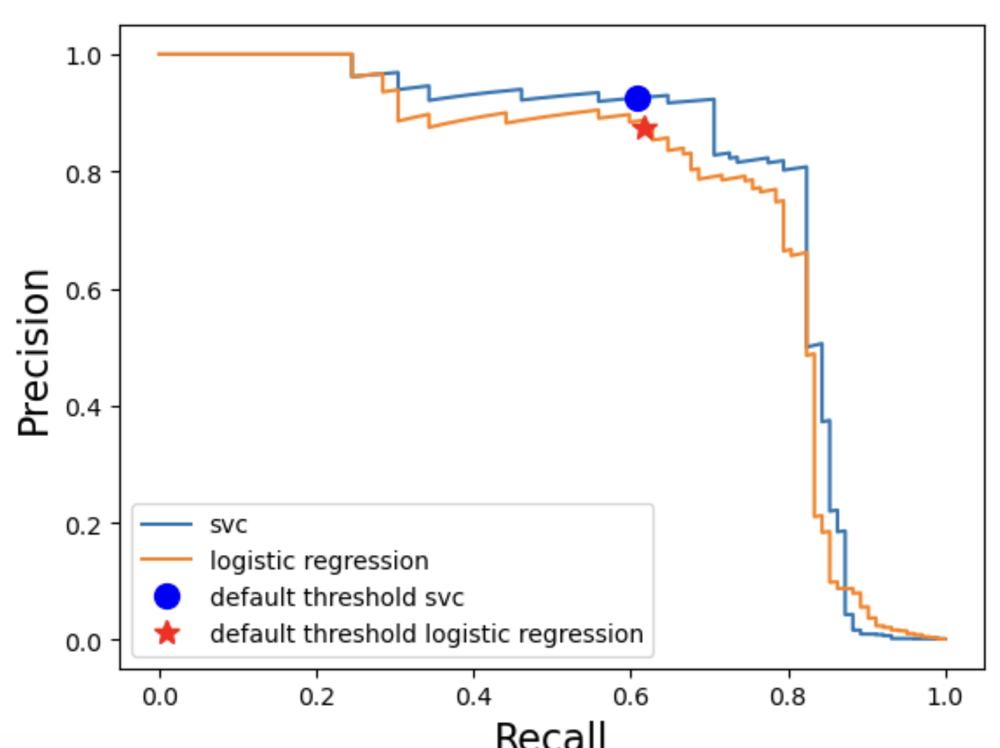
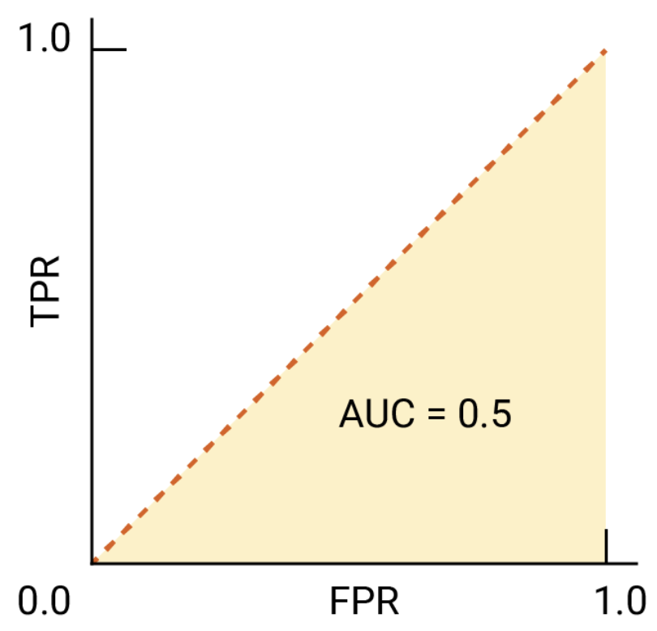
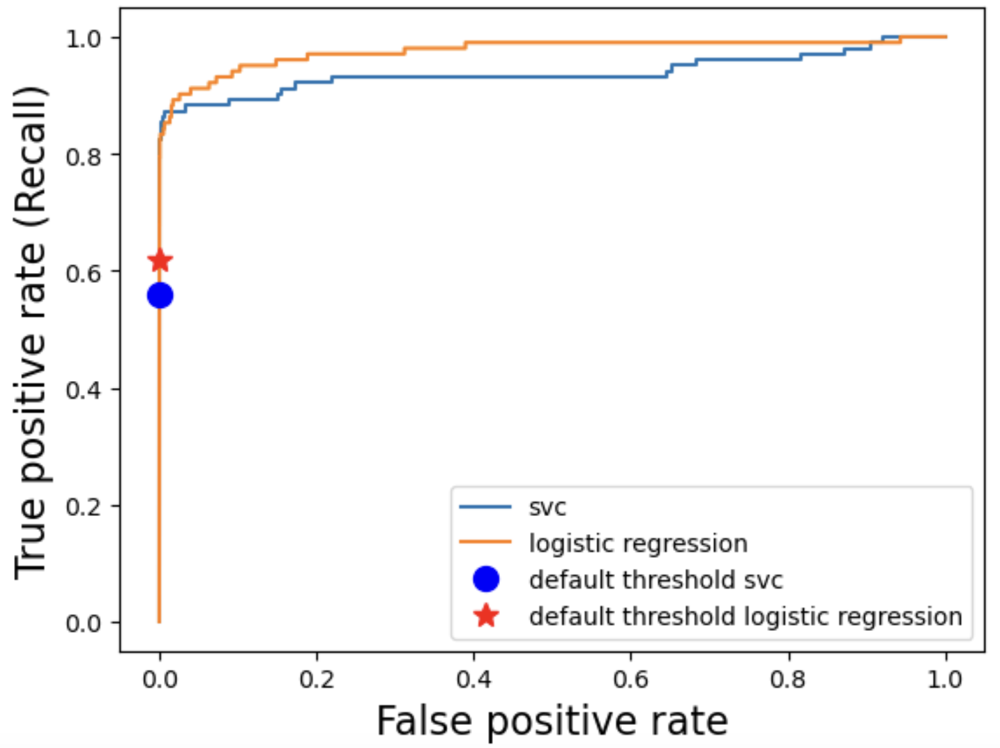

```{python}
import os
import sys
import pandas as pd 
import numpy as np
from sklearn import datasets
from sklearn.svm import SVC
from sklearn.model_selection import cross_val_score, cross_validate, train_test_split
from sklearn.pipeline import Pipeline, make_pipeline
from sklearn.linear_model import LogisticRegression
import matplotlib.pyplot as plt
from sklearn.preprocessing import StandardScaler
%matplotlib inline
from sklearn.dummy import DummyClassifier
from sklearn.model_selection import cross_validate
from sklearn.metrics import ConfusionMatrixDisplay 
import mglearn
plt.rcParams.update({'font.size': 14})
DATA_DIR = '../data/' 
```
## What is a loss function? {.smaller}

- A **loss function** measures how close a model's predictions are to the actual values.
- Regression models are fitted by selecting weights that **minimize the loss**.
- Common regression loss functions:
  - **Absolute loss** (L1)
  - **Squared loss** (L2)
  - **Huber loss**
  - **Quantile loss**
- The choice of loss function affects how the model responds to **large errors and outliers**.

## Residuals and loss

- The **residual** (prediction error) is the difference between the observed and predicted values:
  $$e_i = y_i - \hat{y}_i$$
- A loss function transforms the residual into a measure of error.
- **Small loss** → prediction is close to the observed value.
- **Large loss** → prediction is far from the observed value.
- During model fitting, we choose parameters that minimize the overall loss.

## Absolute loss

- **Absolute loss** measures the absolute value of the prediction error:
  $$L_1(y, \hat{y}) = |y - \hat{y}|$$
- Also called **L1 loss**.
- All errors are penalized proportionally to their size.
- The **Mean Absolute Error (MAE)** is the average absolute loss:
  $$MAE = \frac{1}{n}\sum_{i=1}^{n}|y_i-\hat{y}_i|$$
- **Less sensitive to outliers** than squared loss.

## Squared loss

- **Squared loss** squares the prediction error:
  $$L_2(y, \hat{y}) = (y-\hat{y})^2$$
- Also called **L2 loss**.
- Large errors receive **much larger penalties**.
- The **Mean Squared Error (MSE)** is the average squared loss:
  $$MSE = \frac{1}{n}\sum_{i=1}^{n}(y_i-\hat{y}_i)^2$$
- Ordinary linear regression is typically fitted using **least squares**, which minimizes squared loss.

## Absolute vs. squared loss {.smaller}

| Property | Absolute Loss | Squared Loss |
|----------|---------------|--------------|
| Formula | $|y-\hat{y}|$ | $(y-\hat{y})^2$ |
| Also called | L1 loss | L2 loss |
| Penalizes large errors | Proportionally | **Much more heavily** |
| Sensitive to outliers | Lower | **Higher** |
| Common metric | MAE | MSE / RMSE |

## Why does squared loss care about outliers?

- Squaring an error makes **large prediction errors disproportionately important**.
- Example:
  - Error of 2 → squared loss = 4
  - Error of 10 → squared loss = 100
- A single extreme observation can therefore have a large influence on the fitted regression line.
- **Question:** Which loss would you prefer when your data contain substantial outliers?

## Huber loss

- **Huber loss combines squared and absolute loss.**
- For **small errors**, it behaves like squared loss.
- For **large errors**, it behaves like absolute loss.
- This gives us:
  - Smooth optimization near zero.
  - **Less sensitivity to outliers** than squared loss.
- A hyperparameter $\delta$ controls where the loss transitions from quadratic to linear.

## Huber loss: the best of both? {.smaller}

$$
L_\delta(e) =
\begin{cases}
\frac{1}{2}e^2, & |e| \leq \delta \\
\delta\left(|e|-\frac{1}{2}\delta\right), & |e| > \delta
\end{cases}
$$

- **Small errors:** quadratic → similar to squared loss.
- **Large errors:** linear → similar to absolute loss.
- **Smaller $\delta$:** Huber behaves more like absolute loss.
- **Larger $\delta$:** Huber behaves more like squared loss.

## Quantile loss

- **Quantile loss** allows us to penalize underprediction and overprediction differently.
- Useful for **quantile regression**, where we predict a specific quantile of the target distribution.
- The loss depends on the quantile $\tau$ and whether the prediction is above or below the observed value.
- Examples:
  - $\tau=0.50$ → median regression.
  - $\tau=0.75$ → 75th percentile.
  - $\tau=0.90$ → 90th percentile.

## Quantile loss and asymmetric penalties {.smaller}

- For **small quantiles**, overpredictions receive a larger penalty.
- For **large quantiles**, underpredictions receive a larger penalty.
- At $\tau=0.50$, underprediction and overprediction are penalized equally.
- **Question:** If we are predicting the 90th percentile, should an underprediction or an overprediction receive the larger penalty?

## Choosing a loss function {.smaller}

| Loss Function | Key Property | When to Consider |
|---------------|---------------|------------------|
| **Absolute (L1)** | Linear penalty | Robust to outliers |
| **Squared (L2)** | Large errors heavily penalized | Standard linear regression |
| **Huber** | Squared near 0, linear for large errors | Want robustness + smooth optimization |
| **Quantile** | Asymmetric penalties | Predicting specific quantiles |

## Loss functions in `scikit-learn`

- Absolute loss:
  ```python
  from sklearn.metrics import mean_absolute_error
  ```

- Squared loss:
  ```python
  from sklearn.metrics import mean_squared_error
  ```

- Quantile loss:
  ```python
  from sklearn.metrics import mean_pinball_loss
  ```

- Huber regression:
  ```python
  from sklearn.linear_model import HuberRegressor
  ```

## Comparing loss functions in `scikit-learn` {.smaller}

```python
from sklearn.metrics import (
    mean_absolute_error,
    mean_squared_error,
    mean_pinball_loss
)

y_pred = model.predict(X)

mae = mean_absolute_error(y, y_pred)
mse = mean_squared_error(y, y_pred)
pinball = mean_pinball_loss(y, y_pred, alpha=0.75)

print("MAE:", mae)
print("MSE:", mse)
print("Pinball loss:", pinball)
```

## Fitting a model with Huber loss

```python
from sklearn.linear_model import HuberRegressor

model_huber = HuberRegressor()
model_huber.fit(X, y)

y_pred = model_huber.predict(X)
```

- `HuberRegressor()` fits a linear model using **Huber loss**.
- Small prediction errors are treated similarly to squared loss.
- Large prediction errors are treated more like absolute loss.
- This makes the model **less sensitive to outliers**.

## Comparing Linear Regression and Huber Regression {.smaller}

```python
from sklearn.linear_model import LinearRegression, HuberRegressor
from sklearn.metrics import mean_squared_error, mean_absolute_error

model_lr = LinearRegression()
model_huber = HuberRegressor()

model_lr.fit(X, y)
model_huber.fit(X, y)

y_pred_lr = model_lr.predict(X)
y_pred_huber = model_huber.predict(X)

print("Linear Regression MSE:",
      mean_squared_error(y, y_pred_lr))

print("Huber Regression MSE:",
      mean_squared_error(y, y_pred_huber))
```

## What happens with an outlier?

:::: {.columns}
:::{.column width="50%"}

**Squared loss**

- Large errors are squared.
- Outliers can have a **large influence** on the fitted model.
- The regression line may be pulled toward extreme observations.

:::
:::{.column width="50%"}

**Huber loss**

- Small errors → squared loss.
- Large errors → absolute-like loss.
- Outliers have **less influence** on the fitted model.

:::
::::

## Questions for you {.smaller}

**Select all of the following statements which are TRUE.**

- (A) Regression models are fitted by minimizing a specified loss function.
- (B) Absolute loss is more sensitive to outliers than squared loss.
- (C) Squared loss gives much more weight to large prediction errors.
- (D) Huber loss behaves like squared loss for small errors and absolute loss for large errors.
- (E) Quantile loss can assign different penalties to underpredictions and overpredictions.

## Which loss function would you choose? {.smaller}

| Scenario | Preferred Loss |
|-----------|----------------|
| Outliers are common and should have limited influence. | |
| Large errors are especially costly. | |
| You want a smooth loss that is robust to outliers. | |
| You want to predict the 90th percentile of a target. | |

## Which loss function would you choose? {.smaller}

| Scenario | Preferred Loss |
|-----------|----------------|
| Outliers are common and should have limited influence. | Absolute Loss (MAE) |
| Large errors are especially costly. | 	Squared Loss (MSE) |
| You want a smooth loss that is robust to outliers. | Huber Loss |
| You want to predict the 90th percentile of a target. | 	Quantile Loss (τ = 0.90) |


## Key Takeaways

- A **loss function** tells us how costly a prediction error is.
- **Absolute loss** is more robust to outliers.
- **Squared loss** strongly penalizes large errors and is the standard choice for ordinary least squares.
- **Huber loss** combines the advantages of squared and absolute loss.
- **Quantile loss** allows us to make underprediction and overprediction have different costs.
- In `scikit-learn`, these ideas are available through `mean_absolute_error()`, `mean_squared_error()`, `mean_pinball_loss()`, and `HuberRegressor()`.


## Which metric fits best? {.smaller}

| Scenario | Data Imbalance | Main Concern | Best Metric(s) / Curve |
|-----------|----------------|---------------|------------------------|
| **Email Spam Detection** | 10% spam | Avoid false positives| |
| **Disease Screening** | 1 in 10,000 | Avoid false negatives | |
| **Credit Card Fraud** | 0.1% fraud | Focus on rare positive class | |
| **Customer Churn** | 20% churn | Balance FP & FN | |
| **Sentiment Analysis** | 50/50 balanced | Overall correctness | |
| **Face Recognition** | Balanced pairs | Trade-off FP vs FN | |

## Summary: Choosing the right metric {.smaller}

| Metric / Plot | When to Use | Why |
|---------|----------|----------|
| **Precision, Recall, F1** | When you care about *specific error types* (FP vs FN) or a *fixed threshold*. | Focus on particular tradeoffs. |
| **PR Curve & AP Score** | When the dataset is **highly imbalanced** (rare positives). | Ignores TNs; focuses on positives. |
| **ROC Curve & AUC** | When classes are **moderately imbalanced**. | Measures ranking ability across thresholds. |


## Questions for you 

- What's the difference between the average precision (AP) score and F1-score? 
- Which model would you pick? 



## ROC of a baseline model
:::: {.columns}
:::{.column width="50%"}
 
:::
:::{.column width="50%"}
**AUC–ROC** measures the probability that a randomly chosen **positive example** receives a **higher score** than a randomly chosen **negative example**.  

- **Perfect model:** (AUC = 1.0). Always ranks positives above negatives.  
- **Random model** (AUC = 0.5): No discriminative ability (equivalent to random guessing).  
:::
::::

[Source](https://developers.google.com/machine-learning/crash-course/classification/roc-and-auc)

## Questions for you {.smaller}

:::: {.columns}
:::{.column width="60%"}

:::
:::{.column width="40%"}
- Which model would you pick? 
:::
::::

## Dealing with class imbalance
- Under sampling 
- Oversampling 
- `class weight="balanced"` (preferred method for this course)
- SMOTE

## Handling imbalance by chaning class weights

- We can specify class_weight="balanced" to give more importance to rare examples during training.

```{python}
# This dataset will be loaded using a URL instead of a CSV file
DATA_URL = "https://github.com/firasm/bits/raw/refs/heads/master/creditcard.csv"

cc_df = pd.read_csv(DATA_URL, encoding="latin-1")
# Sorting columns so it is easier to read
cc_df = cc_df[['Class', 'Time', 'Amount'] + cc_df.columns[cc_df.columns.str.startswith('V')].to_list()]

train_df, test_df = train_test_split(cc_df, test_size=0.3, random_state=111)
X_train_big, y_train_big = train_df.drop(columns=["Class", "Time"]), train_df["Class"]
X_test, y_test = test_df.drop(columns=["Class", "Time"]), test_df["Class"]
X_train, X_valid, y_train, y_valid = train_test_split(
    X_train_big, y_train_big, test_size=0.3, random_state=123
)
pipe_lr = make_pipeline(StandardScaler(), LogisticRegression(max_iter=1000))
pipe_lr.fit(X_train, y_train)

pipe_lr_balanced = make_pipeline(
    StandardScaler(), LogisticRegression(max_iter=1000, class_weight="balanced")
)
pipe_lr_balanced.fit(X_train, y_train)

fig, ax = plt.subplots(1, 2, figsize=(12, 5))

ConfusionMatrixDisplay.from_estimator(
    pipe_lr,
    X_valid,
    y_valid,
    values_format="d",
    ax=ax[0],
    display_labels=["Non fraud", "Fraud"],
    colorbar=False
)
ax[0].set_title("LR")

ConfusionMatrixDisplay.from_estimator(
    pipe_lr_balanced,
    X_valid,
    y_valid,
    values_format="d",
    ax=ax[1], 
    display_labels=["Non fraud", "Fraud"],
    colorbar=False
)
ax[1].set_title("balanced")

plt.tight_layout()
plt.show()
```

::: {.notes}
- This sets the weights so that the classes are "equal".
- We have reduced false negatives but we have many more false positives now ...
  - Decreases false negatives, which improves recall.
  - Increases false positives, which might lower precision.
:::

## Comparing Linear Regression and Huber Regression {.smaller}

```python
from sklearn.linear_model import LogisticRegression

model = LogisticRegression(class_weight="balanced")

model.fit(X_train, y_train)

```

## Ridge and RidgeCV
- **Ridge Regression**: `alpha` hyperparameter controls model complexity.
- **RidgeCV**: Ridge regression with built-in cross-validation to find the optimal `alpha`.

## `alpha` hyperparameter
- **Role of `alpha`**:
  - Controls model complexity
  - Higher `alpha`: Simpler model, smaller coefficients.
  - Lower `alpha`: Complex model, larger coefficients.

## Regression metrics: MSE, RMSE, MAPE, r2_score

- **Mean Squared Error (MSE)**: Average of the squares of the errors.
- **Root Mean Squared Error (RMSE)**: Square root of MSE, same units as the target variable.
- **r2** measures how much of the variation in the target variable your model can explain.-
- **Mean Absolute Percentage Error (MAPE)**: Average of the absolute percentage errors.

## Applying log transformation to the targets

- Suitable when the target has a wide range and spans several orders of magnitude 
  - Example: counts data such as social media likes or price data
- Helps manage skewed data, making patterns more apparent and regression models more effective.
- `TransformedTargetRegressor`
  - Wraps a regression model and applies a transformation to the target values.

## Which metric fits the scenario? {.smaller}

| Scenario | What matters most? | Best metric(s)? |
|-----------|-------------------|----------|
| Predicting **house prices** ranging from \$60K–\$800K.  | A \$30K error is huge for a \$60K house but small for a \$500K house. |  |
| Predicting **exam scores** (0–100).  | You want an interpretable measure of average error in **points**. |  |
| Predicting **energy consumption** in a large industrial system. | Large errors are very costly and should be penalized heavily. |  |
| Predicting **insurance claim amounts**. | You want to compare how well different models explain the variation in claims. |  |

## Which metric fits the scenario? {.smaller}

| Scenario | What matters most? | Best metric(s)? |
|-----------|-------------------|----------|
| Predicting **house prices** ranging from \$60K–\$800K.  | A \$30K error is huge for a \$60K house but small for a \$500K house. | MAPE (Mean Absolute Percentage Error)  |
| Predicting **exam scores** (0–100).  | You want an interpretable measure of average error in **points**. | MAE (Mean Absolute Error)  |
| Predicting **energy consumption** in a large industrial system. | Large errors are very costly and should be penalized heavily. | MSE (Mean Squared Error) or RMSE |
| Predicting **insurance claim amounts**. | You want to compare how well different models explain the variation in claims. | R² (R-squared)  |

## Rationale

- **MAPE:**  Measures error relative to the actual value, so a $30K error on a $60K house counts much more than the same error on a $500K house.
- **MAE:** Gives the average absolute error in the same units as the target—here, exam points.
- **MSE/RMSE:**  Squares errors, giving disproportionately more weight to large errors. MSE penalizes them most directly; RMSE is easier to interpret because it is in the original units.
- **R² (R-squared):** Measures the proportion of variation in the target explained by the model, making it useful for comparing how much variation in claim amounts the models account for.

## Which metric fits the scenario? 

- **For interpretability:** prefer RMSE or MAPE
- **When you want to discourage large error:** MSE is common
- **For fair comparison:** r2 provides a normalized score similar to accuracy in classification.  
- **For imbalanced scales:** MAPE helps when proportional error matters more than absolute error.

## 

Slides adapted from Firas Moosvi