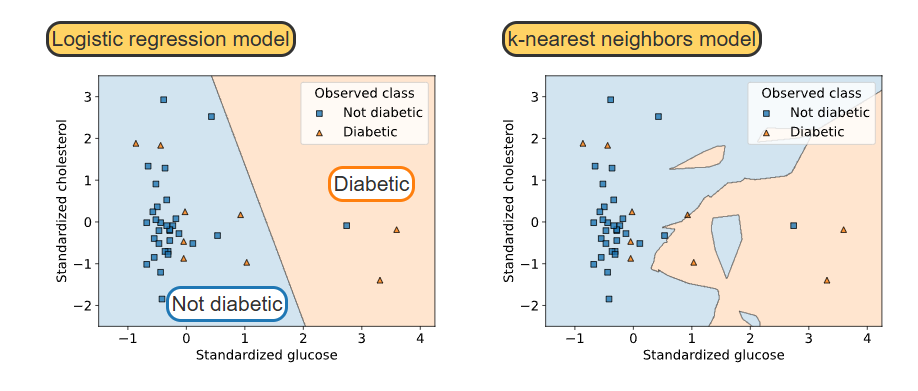

## Evaluating models with plots {.smaller}

- Numeric metrics tell us **how well** a model performs.
- Plots help us understand **how the model is behaving**.
- Visualizations can help us:
  - Examine model fit.
  - Identify patterns in errors.
  - Compare models.
  - Detect possible **overfitting** or **underfitting**.
  - Understand how features affect predictions.

:::: {.columns}
:::{.column width="50%"}

**Classification**

- Decision boundary plot
- ROC curve
- Confusion matrix

:::

:::{.column width="50%"}

**Regression**

- Prediction error plot
- Partial dependence plot

:::
::::


## Decision boundary plots {.smaller}

- A **decision boundary** separates regions of the feature space associated with different classes.
- A decision boundary plot shows how a classifier assigns observations to different classes.
- Particularly useful when there are **two or three input features**.
- We can use the plot to assess:
  - Whether the boundary makes sense.
  - Whether the model is too simple.
  - Whether the model may be **overfitting**.




## Comparing decision boundaries {.smaller}

:::: {.columns}

:::{.column width="50%"}

**Logistic Regression**

- Produces a relatively **simple, linear boundary**.
- Easier to interpret.
- May **underfit** when the relationship between features and classes is complex.

:::

:::{.column width="50%"}

**k-Nearest Neighbors**

- Can produce more **irregular boundaries**.
- Flexible enough to capture local patterns.
- Very irregular boundaries may indicate **overfitting**.

:::

::::

**Question:** Which model would you trust more if the decision boundary closely follows every training observation?


## Interpreting a decision boundary

- Each region of the plot corresponds to a **predicted class**.
- The boundary indicates where the model changes its prediction.
- The observed data points allow us to compare:
  - **Predicted class**
  - **Actual class**
- Misclassified observations appear in a region belonging to the **wrong class**.

**Question:** If an observation lies in the "Diabetic" region but is actually nondiabetic, what has happened?

- The model has made a **false positive**.


## ROC curves and AUC

- An **ROC curve** evaluates a binary classifier across many classification thresholds.
- The x-axis shows the **False Positive Rate (FPR)**:

$$
FPR = \frac{FP}{FP + TN}
$$

- The y-axis shows the **True Positive Rate (TPR)**, also called recall:

$$
TPR = \frac{TP}{TP + FN}
$$

- Each point on the ROC curve corresponds to a different **decision threshold**.


## Understanding the ROC curve {.smaller}

:::: {.columns}

:::{.column width="50%"}

**Perfect classifier**

- AUC = **1.0**
- TPR = 1
- FPR = 0
- Curve reaches the upper-left corner.

**Random classifier**

- AUC = **0.5**
- ROC curve follows the diagonal.
- No useful ability to distinguish the classes.

:::

:::{.column width="50%"}

**Good classifier**

- ROC curve lies **above the diagonal**.
- Higher AUC generally indicates better ranking performance.
- Example:

$$
AUC = 0.84
$$

:::

::::

**Important:** AUC summarizes performance across thresholds; it does **not** select the optimal threshold for you.


## What happens when we change the threshold? {.smaller}

- Classification models often produce a **score or probability**.
- We convert that score into a class using a threshold.
- **Higher threshold:**
  - Fewer positive predictions.
  - Usually fewer false positives.
  - Usually more false negatives.
- **Lower threshold:**
  - More positive predictions.
  - Usually more true positives.
  - Usually more false positives.

:::: {.columns}

:::{.column width="50%"}

**High threshold**

- Higher precision
- Lower recall
- Useful when false positives are costly

:::

:::{.column width="50%"}

**Low threshold**

- Higher recall
- Lower precision
- Useful when false negatives are costly

:::

::::


## ROC curve: an important distinction {.smaller}

- **AUC** evaluates how well the model ranks positive observations above negative observations.
- The ROC curve shows the **trade-off between TPR and FPR** across thresholds.
- AUC can tell us which model has better overall discrimination.
- AUC does **not** tell us which threshold to use in practice.

**Question:** Suppose missing a positive case is extremely costly. Would we necessarily choose the threshold that gives the highest AUC?

**No.** AUC evaluates the model across thresholds; the operational threshold should reflect the cost of **false positives vs. false negatives**.


## ROC curves in `scikit-learn` {.smaller}

```python
from sklearn.metrics import RocCurveDisplay

RocCurveDisplay.from_estimator(
    model,
    X_test,
    y_test
)
```

- `from_estimator()` uses the fitted model to generate predictions.
- The ROC curve is created using the model's prediction scores.
- We can also calculate the AUC directly:

```python
from sklearn.metrics import roc_auc_score

y_score = model.predict_proba(X_test)[:, 1]

auc = roc_auc_score(y_test, y_score)

print("AUC:", auc)
```


## Prediction error plots

- A **prediction error plot**, also called a **residual plot**, shows:
  - Predicted values on the x-axis.
  - Prediction errors (residuals) on the y-axis.

$$
e_i = y_i - \hat{y}_i
$$

- A reference line at:

$$
e_i = 0
$$

  is usually included.

- We use the plot to examine whether the model's errors show a **systematic pattern**.


## What does a good prediction error plot look like? {.smaller}

**Ideal pattern**

- Residuals are randomly scattered around zero.
- Points appear both above and below zero.
- No obvious relationship between predicted values and residuals.
- Similar spread across the range of predictions.

**Warning signs**

- Curved pattern → possible **nonlinear relationship**.
- Funnel-shaped pattern → changing error variance.
- Large isolated residuals → possible **outliers**.
- Systematic pattern → model may be missing important information.


## Interpreting prediction error plots {.smaller}

:::: {.columns}

:::{.column width="50%"}

**Random pattern**

- Residuals centered around zero.
- No obvious structure.
- Model may be adequately capturing the relationship.

:::

:::{.column width="50%"}

**Systematic pattern**

- Residuals follow a curve or other pattern.
- Suggests the model may be missing something.
- Consider:
  - Nonlinear features.
  - Additional predictors.
  - A different model.

:::

::::

**Question:** What might a funnel-shaped residual plot tell us?

- The variability of the prediction errors changes across the range of predicted values.


## Creating a prediction error plot {.smaller}

```python
from sklearn.linear_model import LinearRegression
import matplotlib.pyplot as plt

model = LinearRegression()
model.fit(X, y)

y_pred = model.predict(X)

residuals = y - y_pred

plt.scatter(y_pred, residuals)
plt.axhline(0, color="black", linestyle="--")

plt.xlabel("Predicted values")
plt.ylabel("Residuals")
plt.show()
```

- `y_pred` contains the model's predictions.
- `residuals` measures how far each prediction is from the observed value.
- We look for **patterns**, not just the average size of the errors.


## Partial dependence plots

- A **partial dependence plot (PDP)** shows how an input feature affects the model's **average prediction**.
- We vary one feature while keeping the other features at their observed values.
- The model makes predictions for these modified observations.
- We then average the predictions.

For feature $x_j$:

$$
PD(x_j)
=
\frac{1}{n}
\sum_{i=1}^{n}
f(x_j, x_{i,-j})
$$

- $x_j$ = feature being investigated.
- $x_{i,-j}$ = the other features for observation $i$.


## Interpreting a partial dependence plot {.smaller}

- A PDP answers:

> **"On average, how does changing this feature affect the model's prediction?"**

:::: {.columns}

:::{.column width="50%"}

**Positive relationship**

- PDP increases as the feature increases.
- Higher feature values are associated with higher predictions.

:::

:::{.column width="50%"}

**Negative relationship**

- PDP decreases as the feature increases.
- Higher feature values are associated with lower predictions.

:::

::::

- A nonlinear curve indicates that the model's relationship with the feature changes across its range.
- PDPs describe the **model's behavior**, not necessarily a causal relationship.


## Partial dependence and the observed data {.smaller}

- PDPs are most reliable where we have **many observations**.
- Predictions at values far outside the observed data can be misleading.
- It is useful to show the distribution of the feature along the x-axis.

**Deciles**

- Divide the observed distribution into ten approximately equal groups.
- Vertical marks can show where observations occur.

**Question:** Why should we be cautious about interpreting a PDP where there are very few observations?


## Partial dependence in `scikit-learn` {.smaller}

```python
from sklearn.inspection import PartialDependenceDisplay

PartialDependenceDisplay.from_estimator(
    model,
    X,
    features=[0]
)

plt.show()
```

- `model` must already be fitted.
- `X` contains the input features.
- `features=[0]` requests the PDP for the first feature.
- We can request multiple features:

```python
PartialDependenceDisplay.from_estimator(
    model,
    X,
    features=[0, 1, 2]
)
```


## Classification vs. regression plots {.smaller}

| Model Type | Plot | What does it show? | What can we learn? |
|------------|------|--------------------|---------------------|
| **Classification** | Decision boundary | How features are divided into classes | Model complexity, fit, possible overfitting |
| **Classification** | ROC curve | TPR vs. FPR across thresholds | Classification performance across thresholds |
| **Classification** | Confusion matrix | Counts of TP, TN, FP, FN | Types of classification errors |
| **Regression** | Prediction error | Residuals vs. predictions | Patterns, outliers, changing variance |
| **Regression** | Partial dependence | Feature vs. average prediction | How the model uses an individual feature |


## Which plot should we use? {.smaller}

| Question | Useful Plot |
|----------|-------------|
| How does a classifier divide the feature space? | **Decision boundary** |
| How does classification performance change with the threshold? | **ROC curve** |
| How well does the classifier distinguish positive and negative cases? | **ROC + AUC** |
| Are regression errors randomly distributed? | **Prediction error plot** |
| Are there patterns in the regression residuals? | **Prediction error plot** |
| How does one feature affect model predictions? | **Partial dependence plot** |
| Is a feature's relationship with predictions linear or nonlinear? | **Partial dependence plot** |


## Questions for you {.smaller}

**Select all of the following statements which are TRUE.**

- (A) A decision boundary plot can help us identify possible overfitting in a classifier.
- (B) An ROC curve shows true positive rate versus false positive rate across different thresholds.
- (C) An AUC of 0.5 indicates a perfect classifier.
- (D) A good prediction error plot should show residuals randomly scattered around zero.
- (E) A curved pattern in a prediction error plot may indicate that a model is missing a nonlinear relationship.
- (F) A partial dependence plot shows the causal effect of a feature on the target.


## iClicker Exercise 1 {.smaller}

**Which statements about ROC curves are TRUE?**

- (A) A perfect classifier has an AUC of 1.0.
- (B) A random classifier has an AUC of approximately 0.5.
- (C) Increasing the classification threshold generally decreases both TPR and FPR.
- (D) AUC automatically identifies the optimal classification threshold.
- (E) The ROC curve can be used to examine classifier performance across different thresholds.


## iClicker Exercise 2 {.smaller}

**Which statements about regression plots are TRUE?**

- (A) Residuals are calculated as observed minus predicted values.
- (B) A random scatter of residuals around zero is generally desirable.
- (C) A funnel-shaped residual plot can indicate changing error variance.
- (D) A systematic curve in the residuals can indicate a missing nonlinear relationship.
- (E) A partial dependence plot directly proves that a feature causes changes in the target.


## Group Work: Evaluate a fitted model

For your assigned model:

1. Generate the appropriate evaluation plots.
2. Examine the plots carefully.
3. Identify any unusual patterns.
4. Compare the model with another fitted model.
5. Be prepared to answer:

**What does the plot tell us that a single numeric metric does not?**

Consider:

- Model complexity
- Errors and outliers
- Threshold trade-offs
- Feature effects
- Possible overfitting or underfitting


## Key Takeaways

- **Plots complement numeric metrics** when evaluating machine learning models.
- **Decision boundary plots** show how classifiers divide the feature space.
- **ROC curves** show the trade-off between true positive rate and false positive rate across thresholds.
- **AUC** summarizes a classifier's ranking performance across thresholds.
- **Prediction error plots** help identify patterns, outliers, and problems with regression model fit.
- **Partial dependence plots** show how an input feature affects the model's average prediction.
- A good model evaluation combines **metrics + visualizations + domain knowledge**.
