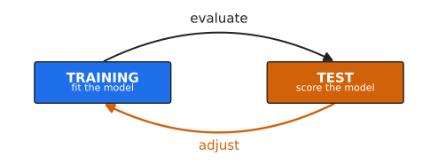
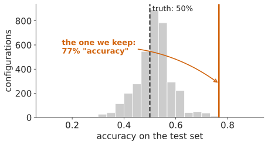
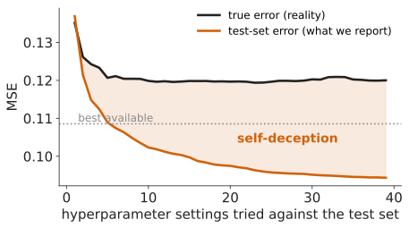
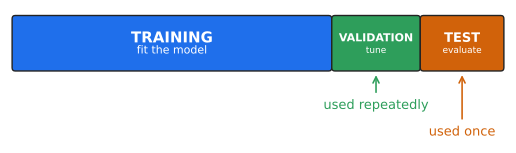
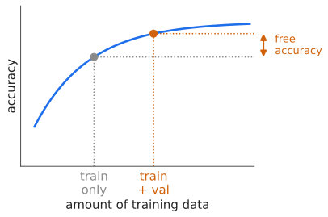
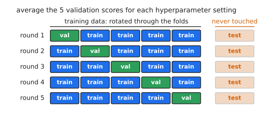
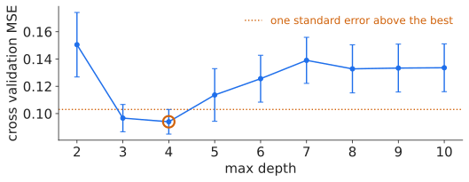

<!--
v2.  Bullets written with "*" unfold one at a time; bullets written with
"-" appear together with the slide.  Ordered steps written "1)" unfold,
"1." do not.  Slides open with the question and the argument arrives as
you walk through it.
-->

# Model Selection and Evaluation

# How Well Will This Work On Data I Do Not Have?

* We want low **generalization error**: error on data the model has never seen.
* **Model selection**: find the model that does as well as possible.
* **Model evaluation**: predict how well it will do once it is deployed.

## Parameters vs. Hyperparameters
::: {.nonincremental}
* **Parameters** are learned from the training data.
  * Polynomial coefficients. The split points in a decision tree.
* **Hyperparameters** are chosen *before* learning starts.
  * Degree of the polynomial. Max depth, max leaves, gini vs. entropy.
* "Model selection" involves picking an algorithm *and* setting all hyperparameters.
:::

## First Idea: Hold Some Data Back

* Fit on the training set. Score on the test set. That score estimates generalization error.
* What's the problem?

## We Never Train Just Once

* We train, score, adjust, and repeat until something looks good.

## Let's run an experiment

- We are given 60 training samples, 30 test samples
  - Five real-valued attributes with binary labels
- Asked to tune a decision tree to maximize accuracy on test set.
- Lets go!

## What We Found

* The labels were assigned by coin flip, independently of the attributes, so no model can be expected to exceed 50% on unseen data.

## And On A Real Problem

* More searching keeps improving the number we report.

## Three Sets

* Tune against the **validation** set. Lock the **test** set away.

## Refit Before You Ship

* Once the hyperparameters are chosen, the validation set has done its job.
* More training data means a better model, so refit on **training + validation**.
* Then, and only then, unlock the test set.

## The Protocol

1) Split into training / validation / test.
2) Search hyperparameters, scoring on **validation**.
3) Refit the chosen model on **training + validation**.
4) Score once on **test**. Report that number.

## "What If The Test Score Comes Back Bad?"

## k-Fold Cross Validation

* Every training sample gets a turn as validation data.
* What is the downside?
* Cross validation helps with model selection, but not model evaluation: **Nested cross validation** goes one level further. Most people stop before that.

## Another Advantage of K-Fold: Which Differences Are Real?

<!--
Careful with the statistics.  Bars that merely fail to overlap are NOT proof
of a difference: for two independent means with equal standard errors, bars
that just touch correspond to only p ~ 0.16.  Paired t-tests over the ten
folds, against the best (depth 4):

    depth 2 vs 4  p = 0.054   (bars nowhere near overlapping)
    depth 3 vs 4  p = 0.78
    depth 5 vs 4  p = 0.19
    depth 6 vs 4  p = 0.062   (bars do not overlap)
    depth 7 vs 4  p = 0.012

So depth 2 looks obviously worse and still does not clear p < 0.05.  The
dotted line is the one-standard-error rule, a parsimony heuristic, not a
significance test.  A proper comparison uses a paired test on the per-fold
differences, and even that is optimistic because the folds share training
data.
-->

* Ten folds give ten scores per setting: a **spread**, not just an average.
* Depths 3 and 4 fall below the line. Nothing separates them, so take the simpler.
* Depths 7 and up sit clearly above it.
* One split gives a single number and no spread at all.

## When *not* to cross-validate

* It is all a response to **not having enough data**.
* A million test samples? That estimate is already fine.
* A large validation set? One split is enough, skip cross validation.

## The Assumption Underneath All Of This

Everything today assumes the training data and the deployment data come from the **same distribution**.

* Never quite true. It is hard to collect data that is perfectly representative.
* Even if you do, the world changes between collection and deployment.

## Mistakes Have Costs

<!--
Both figures verified against the papers.

Obermeyer, Powers, Vogeli and Mullainathan, "Dissecting racial bias in an
algorithm used to manage the health of populations", Science 366(6464):
447-453, 2019.  doi:10.1126/science.aax2342.  "at a given risk score, Black
patients are considerably sicker than White patients."  Remedying it
"would increase the percentage of Black patients receiving additional help
from 17.7 to 46.5%."  The cause: the algorithm predicted health care costs
rather than illness, and less is spent caring for Black patients at the same
level of need.

Wong, Otles, Donnelly et al., "External Validation of a Widely Implemented
Proprietary Sepsis Prediction Model in Hospitalized Patients", JAMA Internal
Medicine 181(8):1065-1070, 2021.  doi:10.1001/jamainternmed.2021.2626.
27,697 patients, 38,455 hospitalizations, sepsis in 2,552 (6.6%).  AUC 0.63
(95% CI 0.62-0.64), "substantially worse than that reported by Epic Systems
(AUC, 0.76-0.83)."  Sensitivity 33%; "did not identify 1709 patients with
sepsis (67%)" while alerting on 18% of hospitalizations.
-->

* **A hospital risk model used on millions of patients.** Race was never an input. It predicted *cost* as a stand-in for *need*, and less is spent on Black patients at the same level of illness. Fixing the target raised the share of Black patients flagged for extra care from **17.7%** to **46.5%**.
* **A sepsis model, widely deployed in US hospitals.** Documented at an AUC of 0.76 to 0.83. Independent validation over 38,455 hospitalizations measured **0.63**, missing **67%** of sepsis cases.
* Neither team set out to harm anyone. One measured the wrong quantity. The other trusted a number nobody outside had checked.
* A test set drawn from the same skewed source will **certify** a bias, not reveal it.

Obermeyer, Powers, Vogeli &amp; Mullainathan. Dissecting racial bias in an algorithm used to manage the health of populations. *Science* 366(6464):447&ndash;453, 2019. doi:10.1126/science.aax2342 
Wong, Otles, Donnelly et al. External validation of a widely implemented proprietary sepsis prediction model in hospitalized patients. *JAMA Intern Med* 181(8):1065&ndash;1070, 2021. doi:10.1001/jamainternmed.2021.2626

