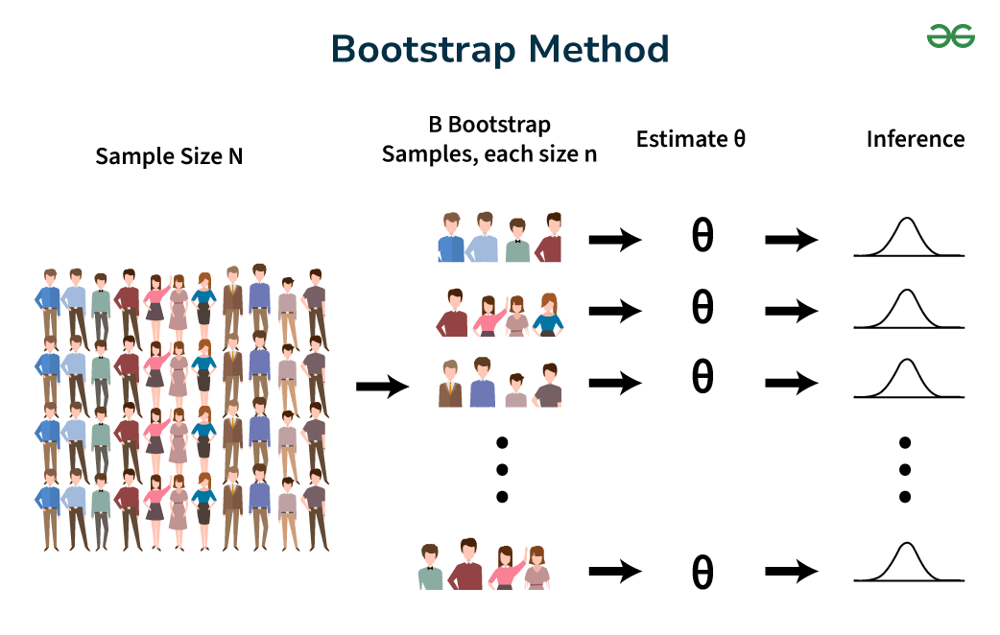
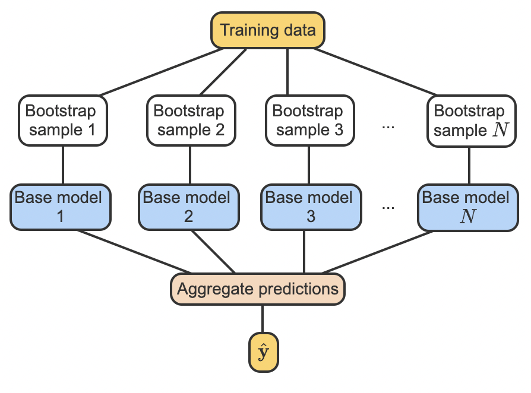
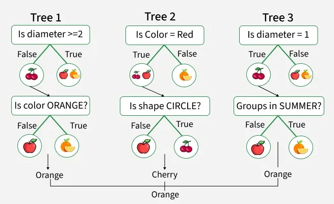

# Learning Goals

By the end of this lesson, you should be able to:

- Explain **bootstrapping** and **bagging**
- Explain how bagging reduces **variance**
- Describe how **Random Forests** extend bagging
- Calculate and interpret **feature importance**
- Distinguish **MDI** from **permutation importance**
- Explain why feature importance **does not imply causation**

# The Big Picture

Machine learning models can be sensitive to the training data.

**Ensemble learning** improves predictions by combining multiple models.

The key idea:

> **Instead of relying on one model, combine many models.**

Two concepts drive today's lesson:

- **Bootstrapping** → creates different training datasets
- **Bagging** → trains and combines multiple models

# Bootstrapping

:::: {columns}
::: {.column width="50%"}

**Bootstrapping** is resampling **with replacement**.

Given a dataset with \(n\) observations:

1. Randomly sample an observation
2. Replace it
3. Sample again
4. Continue until \(n\) observations are selected
:::

::: {.column width="50%"}

Example:

```
A B C D E
```

Bootstrap sample:

```
A C C E B
```

Notice:

- C appears twice
- D is missing
- The sample still contains **5 observations**
:::
::::

# 



# Multiple Bootstrap Samples
:::: {columns}
::: {.column width="50%"}

Starting with:

```
A B C D E
```

We might create:

| Sample | Bootstrap dataset |
|---|---|
| 1 | A C C E B |
| 2 | D D A B E |
| 3 | B A E E C |
| 4 | C C D A A |
:::

::: {.column width="50%"}

Each sample:

- Has the same size as the original
- Contains repeated observations
- May leave out some observations

This gives us **different versions of the training data**.
:::
::::

# From Bootstrapping to Bagging
:::: {columns}
::: {.column width="50%"}

Now train a separate model on each bootstrap sample.


:::
::: {.column width="50%"}

This is **Bagging**:

> **Bootstrap Aggregating**

The process:

```
Training Data
      ↓
Bootstrap Samples
      ↓
Multiple Models
      ↓
Aggregate Predictions
      ↓
Final Prediction
```
:::
::::

## Bagging: Classification vs. Regression

### Classification → Majority Vote

Five models predict:

```
Cat, Dog, Cat, Cat, Dog
```

Final prediction:

```
Cat
```

because Cat receives **3 of 5 votes**.

### Regression → Average

Five models predict:

```
10, 12, 11, 15, 12
```

Final prediction:

$$
\frac{10+12+11+15+12}{5}=12
$$

# Why Does Bagging Help?

Some models have **high variance**.

For example, a decision tree can change substantially when the training data changes slightly.

Bagging:

- Trains many models on different bootstrap samples
- Produces different predictions
- Aggregates those predictions

> **Averaging many unstable models can produce a more stable model.**

Bagging primarily reduces **variance**.

# Bias–Variance Tradeoff

A simplified view of prediction error is:

$$
\text{Error}
\approx
\text{Bias}^2 + \text{Variance} + \text{Noise}
$$

Bagging primarily targets:

## **Variance**

It generally does **not** dramatically reduce the bias of the base model.

This is why bagging is especially useful for flexible, high-variance models such as decision trees.

---

## Bootstrapping vs. Bagging

| Bootstrapping | Bagging |
|---|---|
| Resampling technique | Ensemble method |
| Creates datasets | Creates and combines models |
| Samples with replacement | Usually uses bootstrap samples |
| Can be used for statistical inference | Used for predictive modeling |
| Does not require ML models | Requires multiple models |

### Remember

> **Bootstrapping creates the samples. Bagging uses those samples to build an ensemble.**

# Bagging in Scikit-Learn

```
from sklearn.ensemble import BaggingClassifier
from sklearn.tree import DecisionTreeClassifier

model = BaggingClassifier(
    estimator=DecisionTreeClassifier(),
    n_estimators=100,
    random_state=42
)

model.fit(X_train, y_train)

y_pred = model.predict(X_test)
```

`n_estimators=100` means we train **100 base models**.

# Random Forest

**Random Forest** is a specialized form of bagging.

It combines:

- Bootstrap samples
- Multiple decision trees
- Random subsets of features at each split

#
:::: {columns}
::: {.column width="50%"}


:::

::: {.column width="50%"}

Conceptually:

```
Training Data
      ↓
Bootstrap Samples
      ↓
Tree 1   Tree 2   Tree 3   ...   Tree B
      ↓      ↓       ↓
      └──────┴───────┴──────┘
             ↓
      Aggregate Predictions
             ↓
       Final Prediction
```

Random feature selection makes the trees **less correlated**, which can improve the ensemble.
:::
::::

# Random Forest in Python

```
from sklearn.ensemble import RandomForestClassifier

rf = RandomForestClassifier(
    n_estimators=100,
    random_state=42
)

rf.fit(X_train, y_train)

y_pred = rf.predict(X_test)
```

### Key idea

> **Random Forest = Bagged decision trees + random feature selection**

# Feature Importance

A Random Forest can tell us which features were useful for prediction.

Example:

| Feature | Importance |
|---|---:|
| Contract Length | 0.40 |
| Monthly Charges | 0.25 |
| Tenure | 0.20 |
| Age | 0.15 |

A high score means the model found the feature **useful for prediction**.

It does **not** mean the feature causes the outcome.

# Mean Decrease in Impurity (MDI)

Scikit-learn's default Random Forest importance is based on:

## **Mean Decrease in Impurity (MDI)**

A feature receives importance when it produces useful tree splits.

For classification, one common impurity measure is **Gini impurity**:

$$
Gini = 1-\sum_{k=1}^{K}p_k^2
$$

A good split makes child nodes more homogeneous, reducing impurity.

The importance is aggregated across **all trees**.

# Feature Importance in Python

Scikit-learn provides:

```
rf.feature_importances_
```

To associate importance with feature names:

```
import pandas as pd

importance = pd.Series(
    rf.feature_importances_,
    index=X_train.columns
).sort_values(ascending=False)

print(importance)
```

The values typically sum to **1**.

# Visualizing Feature Importance

```
import matplotlib.pyplot as plt

importance.sort_values().plot(
    kind="barh"
)

plt.xlabel("Feature Importance")
plt.title("Random Forest Feature Importance")
plt.show()
```

This provides a quick view of which features the model relied on most.

# Permutation Importance

MDI has limitations, especially with:

- High-cardinality features
- Features with many possible split points
- Correlated features

An alternative is **permutation importance**.

# Permutation Importance

The idea:

> **Shuffle one feature and measure how much model performance decreases.**

Example:

```
Original accuracy:       92%
Shuffle Age:             91%
Shuffle Contract Length: 72%
```

Contract Length causes a much larger performance drop, suggesting it is more important to the model's predictions.

# Permutation Importance in Python

```
from sklearn.inspection import permutation_importance

result = permutation_importance(
    rf,
    X_test,
    y_test,
    n_repeats=10,
    random_state=42
)

importance = pd.Series(
    result.importances_mean,
    index=X_test.columns
).sort_values(ascending=False)

print(importance)
```

Permutation importance is based on **changes in model performance**, not tree impurity.

# MDI vs. Permutation Importance

| | MDI | Permutation |
|---|---|---|
| Scikit-learn | `feature_importances_` | `permutation_importance()` |
| Based on | Tree splits | Model performance |
| Measures | Impurity reduction | Performance decrease |
| Speed | Fast | Slower |
| Potential bias | Yes | Less affected by some MDI biases |

::: {.callout-note}

## Remember

**MDI asks:**

> How much did this feature help reduce impurity in the trees?

**Permutation asks:**

> How much does model performance suffer when this feature is shuffled?
:::

# Important: Importance ≠ Causation

Suppose:

```
Income → importance = 0.40
```

We can conclude:

> Income was useful for the model's predictions.

We **cannot** conclude:

> Income causes the outcome.

Feature importance describes the behavior of a **predictive model**, not a causal relationship.

# Correlated Features

Suppose the dataset contains:

```
Annual Salary
Monthly Salary
```

These features contain very similar information.

Importance may be distributed between them.

Therefore:

> **A low importance score does not necessarily mean a feature is unimportant.**

Always consider relationships between features when interpreting importance.

# Putting It All Together

```
Training Data
     ↓
Bootstrap Samples
     ↓
Multiple Decision Trees
     ↓
Random Feature Selection
     ↓
Random Forest
     ↓
Predictions
     ↓
Feature Importance
     ├── MDI
     └── Permutation Importance
```

The overall goal is to build a model that is:

- More stable
- Less sensitive to the training sample
- Stronger than an individual decision tree

# Key Takeaways

- **Bootstrapping** = sampling **with replacement**
- **Bagging** = train multiple models on bootstrap samples and aggregate predictions
- Bagging primarily **reduces variance**
- **Random Forest** = bagged decision trees + random feature selection
- `feature_importances_` provides **MDI-based importance**
- **Permutation importance** measures performance loss after shuffling a feature
- Correlated features can make importance difficult to interpret
- **Feature importance ≠ causation**

# Quick Check

---

### Question

A Random Forest gives:

```
Income → importance = 0.40
```

What can we conclude?

**A.** Income causes the outcome.

**B.** Income was useful for the model's predictions.

**C.** Increasing income will increase the prediction.

**D.** Income is statistically significant.

::: {.fragment}

### Answer: **B** ✓

:::

# One Sentence to Remember

> **Bootstrapping creates different datasets; bagging combines models to reduce variance; Random Forest extends bagging with random feature selection; and feature importance tells us what the model found useful—not what causes the outcome.**
